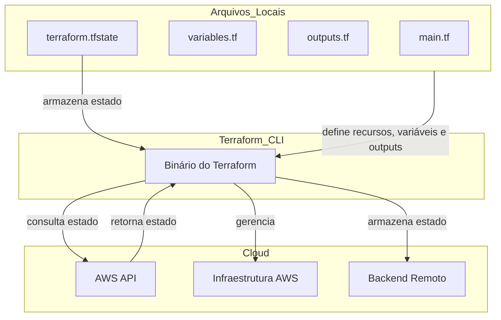
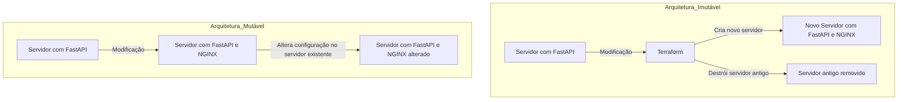

# Workshop de Terraform para Profissionais de Dados

Bem-vindo ao **Workshop de Terraform para Profissionais de Dados**! Este projeto faz parte de um workshop prático exclusivo para os alunos da **Escola Jornada de Dados**.

## Sobre o Workshop

**Data:** Sábado, 10 de Agosto  
**Horário:** 9:00 da manhã  
**Duração:** 5 horas  
**Público:** Exclusivo para alunos da Jornada de Dados

### Objetivos do Workshop

- Introduzir os conceitos básicos e avançados do Terraform.
- Capacitar os alunos a gerenciar e automatizar a infraestrutura de cloud com foco em AWS.
- Demonstrar práticas recomendadas para o uso do Terraform em ambientes de produção.

### Agenda

#### Introdução e Fundamentos

- **Conceitos Básicos de Infraestrutura como Código (IaC)**
  - O que é IaC?
  - Benefícios do IaC
  - Visão geral do Terraform

- **Instalação e Configuração**
  - Instalação do Terraform
  - Configuração inicial e providers (foco em AWS)
  - Primeiros passos com o Terraform CLI

- **Estrutura do Terraform**
  - Arquivos e diretórios
  - Configuração básica: `main.tf`, `variables.tf`, e `outputs.tf`
  - Estado do Terraform (`terraform.tfstate`)

### Implementações e Prática

- **Primeira Implementação**
  - Subindo uma aplicação de Docker no Streamlit
  - Uso de variáveis e outputs
  - Comandos básicos: `init`, `plan`, `apply`, e `destroy`

- **Segunda Implementação**
  - Subindo uma aplicação de storage (S3) e compute (EC2) no LocalStack
  - Uso de módulos para organizar o código
  - Gerenciamento de estado

- **Terceira Implementação**
  - Subindo uma aplicação de storage e compute na AWS
  - Integração com serviços AWS

- **Hands-on Lab**
  - Prática guiada: provisionar recursos na AWS e LocalStack

### Encerramento

- **Perguntas e Respostas**
  - Sessão de perguntas e respostas
  - Próximos passos e recursos adicionais
  - Feedback dos participantes

### Pré-requisitos

- Conhecimento básico de AWS
- Experiência com docker
- Noções básicas de redes e segurança

### Materiais Fornecidos

- [Excalidraw](https://link.excalidraw.com/l/8pvW6zbNUnD/8ACp9pQ84Oz) e documentação do workshop
- Exemplos de código Terraform

## O que é o Terraform

### O que é Terraform?

Terraform é a ferramenta de infraestrutura como código (IaC) da HashiCorp. Permite definir recursos e infraestrutura em arquivos de configuração declarativos e legíveis por humanos, gerenciando o ciclo de vida da sua infraestrutura. O uso do Terraform oferece várias vantagens sobre a gestão manual da infraestrutura:

- **Gerenciamento Multicloud**: O Terraform pode gerenciar infraestruturas em várias plataformas de cloud.
- **Linguagem de Configuração Legível**: A linguagem de configuração do Terraform ajuda a escrever código de infraestrutura rapidamente.
- **Rastreamento de Estado**: O estado do Terraform permite acompanhar as mudanças nos recursos ao longo dos seus deployments.
- **Controle de Versão**: Você pode cometer suas configurações em sistemas de controle de versão para colaborar de forma segura na infraestrutura.

### Gerencie Qualquer Infraestrutura

Os plugins do Terraform, chamados de providers, permitem que ele interaja com plataformas de cloud e outros serviços através de suas APIs. A HashiCorp e a comunidade Terraform escreveram mais de 1.000 providers para gerenciar recursos na Amazon Web Services (AWS), Azure, Google Cloud Platform (GCP), Kubernetes, Helm, GitHub, Splunk e DataDog, entre outros. Você pode encontrar providers para muitas das plataformas e serviços que já usa no Terraform Registry. Se não encontrar o provider que procura, pode escrever o seu próprio.

### Padronize seu Fluxo de Trabalho de Deployment

Os providers definem unidades individuais de infraestrutura, como instâncias de computação ou redes privadas, como recursos. Você pode compor recursos de diferentes providers em configurações reutilizáveis chamadas módulos e gerenciá-los com uma linguagem e fluxo de trabalho consistentes.

A linguagem de configuração do Terraform é declarativa, o que significa que descreve o estado final desejado para sua infraestrutura, em contraste com linguagens de programação procedurais que exigem instruções passo a passo para realizar tarefas. Os providers do Terraform calculam automaticamente as dependências entre recursos para criá-los ou destruí-los na ordem correta.

### Fluxo de Trabalho de Deployment do Terraform

Para implantar infraestrutura com o Terraform:

1. **Escopo**: Identifique a infraestrutura para o seu projeto.
2. **Autor**: Escreva a configuração para sua infraestrutura.
3. **Inicialize**: Instale os plugins que o Terraform precisa para gerenciar a infraestrutura.
4. **Planeje**: Veja uma prévia das mudanças que o Terraform fará para corresponder à sua configuração.
5. **Aplique**: Realize as mudanças planejadas.

### Rastreie sua Infraestrutura

O Terraform acompanha sua infraestrutura real em um arquivo de estado, que atua como uma fonte de verdade para seu ambiente. O Terraform usa o arquivo de estado para determinar as mudanças a serem feitas na sua infraestrutura para que ela corresponda à sua configuração.

### Colabore

O Terraform permite que você colabore na sua infraestrutura com seus backends de estado remoto. Quando você usa o HCP Terraform (gratuito para até cinco usuários), pode compartilhar seu estado com segurança com sua equipe, fornecer um ambiente estável para o Terraform operar e prevenir condições de corrida quando várias pessoas fazem mudanças na configuração ao mesmo tempo.

Você também pode conectar o HCP Terraform a sistemas de controle de versão (VCS) como GitHub, GitLab e outros, permitindo que ele proponha automaticamente mudanças na infraestrutura quando você comete mudanças na configuração para o VCS. Isso permite gerenciar mudanças na sua infraestrutura através do controle de versão, assim como faria com código de aplicação.

### Arquitetura Terraform

### Descrição da Estrutura

1. **Arquivos Locais**:
    - `main.tf`: Define os recursos que serão gerenciados pelo Terraform.
    - `variables.tf`: Define as variáveis que podem ser usadas em `main.tf` e outros arquivos.
    - `outputs.tf`: Define os outputs que serão retornados após a aplicação das configurações.
    - `terraform.tfstate`: Armazena o estado atual da infraestrutura gerenciada pelo Terraform.

2. **Terraform CLI**:
    - Binário do Terraform que lê os arquivos `.tf`, aplica as configurações e gerencia o estado.

3. **Cloud**:
    - `AWS API`: Interface de programação de aplicativos que o Terraform usa para consultar o estado atual da infraestrutura na AWS.
    - `AWS Infrastructure`: Representa a infraestrutura na AWS gerenciada pelo Terraform.
    - `Remote Backend`: Pode ser usado para armazenar o estado do Terraform remotamente (ex.: S3, Azure Blob Storage, etc.).

### Processo de Funcionamento

- Os arquivos locais (`main.tf`, `variables.tf`, `outputs.tf`) definem os recursos, variáveis e outputs para o Terraform.
- O arquivo `terraform.tfstate` armazena o estado atual da infraestrutura gerenciada.
- O Terraform Binary lê as definições dos arquivos locais e o estado armazenado.
- O Terraform consulta o estado atual da infraestrutura na cloud através da `AWS API`.
- Com base na comparação entre o estado armazenado e o estado atual consultado, o Terraform aplica as mudanças necessárias na `AWS Infrastructure`.
- O estado pode ser armazenado remotamente em um `Remote Backend` para facilitar a colaboração e a segurança

## Arquitetura de Servidores: Mutável vs Imutável

### Descrição do Diagrama

#### Arquitetura Mutável

1. **Servidor com FastAPI**: Inicialmente, temos um servidor rodando uma aplicação FastAPI.
2. **Modificação**: Surge a necessidade de adicionar o NGINX.
3. **Servidor com FastAPI e NGINX**: O servidor existente é modificado diretamente para incluir o NGINX.
4. **Servidor com FastAPI e NGINX (alterado)**: A configuração é alterada no servidor existente, mantendo o mesmo servidor com a nova configuração.

#### Arquitetura Imutável

1. **Servidor com FastAPI**: Inicialmente, temos um servidor rodando uma aplicação FastAPI.
2. **Modificação**: Surge a necessidade de adicionar o NGINX.
3. **Terraform**: O Terraform é usado para criar a nova infraestrutura.
4. **Novo Servidor com FastAPI e NGINX**: Um novo servidor é criado com a aplicação FastAPI e NGINX.
5. **Servidor antigo removido**: O servidor antigo é destruído, garantindo que a infraestrutura seja imutável e que qualquer modificação resulte na criação de uma nova instância.

### Vantagens da Arquitetura Imutável

- **Consistência**: Garante que cada mudança na infraestrutura resulte em uma nova instância, evitando divergências de configuração.
- **Reprodutibilidade**: Facilita a reprodução do ambiente, garantindo que as novas instâncias sejam idênticas.
- **Facilidade de reversão**: Caso algo dê errado, é fácil reverter para a configuração anterior, simplesmente destruindo a nova instância e recriando a antiga.

### Vantagens da Arquitetura Mutável

- **Rapidez nas alterações**: Permite modificações rápidas no servidor existente.
- **Menor custo**: Pode ser mais econômico em termos de recursos computacionais, pois não requer a criação de novas instâncias para cada alteração.
