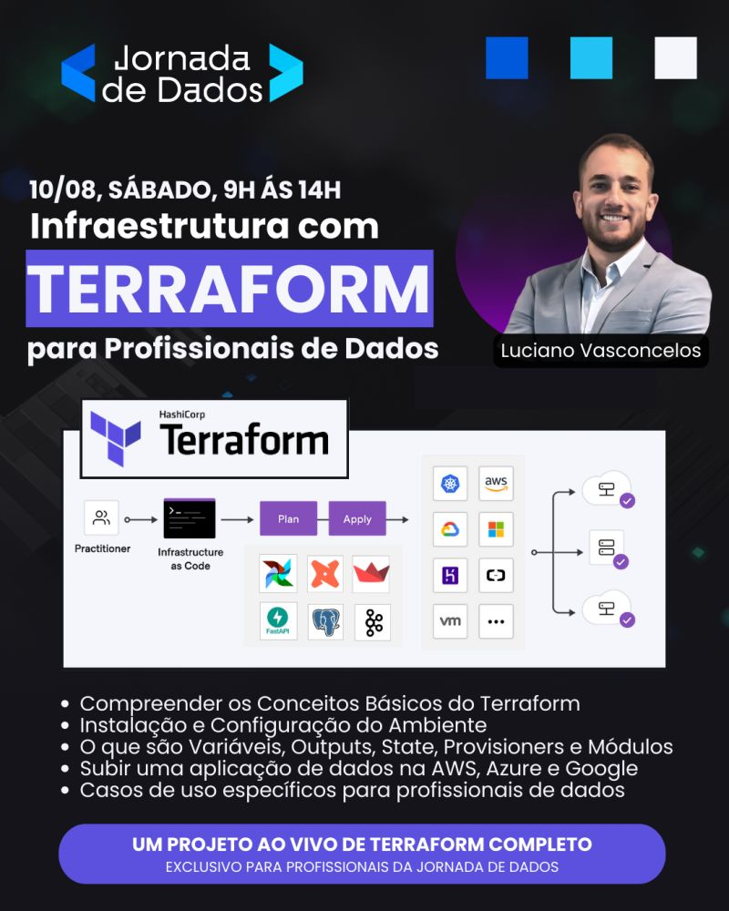
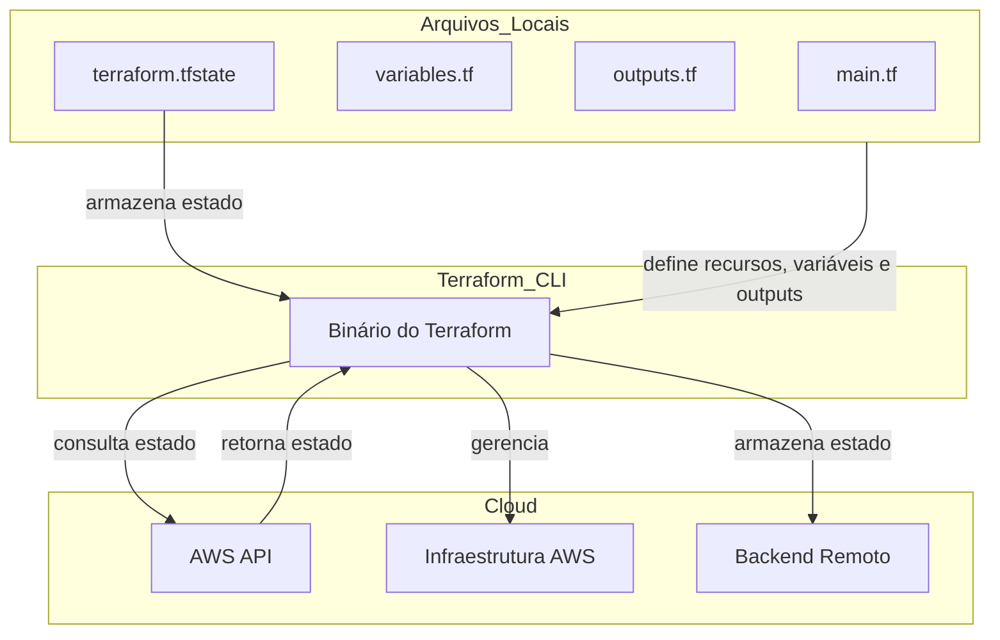

# Workshop de Terraform para Profissionais de Dados

Bem-vindo ao **Workshop de Terraform para Profissionais de Dados**! Este projeto faz parte de um workshop prático exclusivo para os alunos da **Escola Jornada de Dados**.

## Sobre o Workshop

**Data:** Sábado, 10 de Agosto  
**Horário:** 9:00 da manhã  
**Duração:** 4 horas  
**Público:** Exclusivo para alunos da Jornada de Dados

### Objetivos do Workshop

- Introduzir os conceitos do Terraform.
- Capacitar os alunos a gerenciar e automatizar a infraestrutura de cloud com foco em AWS.
- Demonstrar práticas recomendadas para o uso do Terraform em ambientes de produção.

Obrigado pela atualização! Aqui está a pauta ajustada para o workshop de Terraform, com o horário correto:

Claro! Aqui está a atualização para as partes do workshop, ajustando os tópicos conforme solicitado:

### Parte 01 Abertura - O que queremos resolver? (9:00 - 10:00)
   - **Objetivo**: Introduzir o Terraform, discutindo a importância da automação e da infraestrutura como código (IaC) para engenheiros de dados.
   - **Atividades**:
     - Apresentação dos objetivos do treinamento.
     - O que é cloud?
     - Configurando nosso Terraform e Amazon CLI
     - Discussão sobre os desafios de gerenciar infraestrutura em nuvem manualmente e como o Terraform pode ajudar.
     - Subindo um bucket via UI e um bucket via Terraform

### Parte 02 Criando Infraestrutura para Dashboard (10:00 - 10:30)
   - **Objetivo**: Demonstrar o processo manual de criação de infraestrutura na AWS, sem utilizar Terraform.
   - **Atividades**:
     - Configuração manual de uma instância EC2 e Security Groups.
     - Deploy manual de uma aplicação Dashboard.
     - Criação de um ambiente de dev e de prod.
     - Discussão sobre as limitações e desafios desse processo manual.

### Parte 03 e parte 04 Criando uma API e com RDS (10:30 - 11:30)
   - **Objetivo**: Mostrar como criar manualmente esse processo e com terraform
   - **Atividades**:
     - Comparação entre o processo manual e o automatizado.
     - Discussão sobre boas práticas e vantagens do Terraform.
     - Como gerenciar multiplos recursos

### Parte 05 Variáveis e validação de variáveis (11:30 - 12:00)

### Parte 06 Terraform State e Console (12:30 - 13:00)

### Parte 07 Migração do Projeto da AWS para Azure (12:00 - 12:30)

### 8. Dúvidas e sorteios

## O que é Terraform?

Terraform é a ferramenta de infraestrutura como código (IaC) da HashiCorp. Permite definir recursos e infraestrutura em arquivos de configuração declarativos e legíveis por humanos, gerenciando o ciclo de vida da sua infraestrutura. O uso do Terraform oferece várias vantagens sobre a gestão manual da infraestrutura:

- **Gerenciamento Multicloud**: O Terraform pode gerenciar infraestruturas em várias plataformas de cloud.
- **Linguagem de Configuração Legível**: A linguagem de configuração do Terraform ajuda a escrever código de infraestrutura rapidamente.
- **Rastreamento de Estado**: O estado do Terraform permite acompanhar as mudanças nos recursos ao longo dos seus deployments.
- **Controle de Versão**: Você pode cometer suas configurações em sistemas de controle de versão para colaborar de forma segura na infraestrutura.

### Gerencie Qualquer Infraestrutura

Os plugins do Terraform, chamados de providers, permitem que ele interaja com plataformas de cloud e outros serviços através de suas APIs. A HashiCorp e a comunidade Terraform escreveram mais de 1.000 providers para gerenciar recursos na Amazon Web Services (AWS), Azure, Google Cloud Platform (GCP), Kubernetes, Helm, GitHub, Splunk e DataDog, entre outros. Você pode encontrar providers para muitas das plataformas e serviços que já usa no Terraform Registry. Se não encontrar o provider que procura, pode escrever o seu próprio.

### Padronize seu Fluxo de Trabalho de Deployment

Os providers definem unidades individuais de infraestrutura, como instâncias de computação ou redes privadas, como recursos. Você pode compor recursos de diferentes providers em configurações reutilizáveis chamadas módulos e gerenciá-los com uma linguagem e fluxo de trabalho consistentes.

A linguagem de configuração do Terraform é declarativa, o que significa que descreve o estado final desejado para sua infraestrutura, em contraste com linguagens de programação procedurais que exigem instruções passo a passo para realizar tarefas. Os providers do Terraform calculam automaticamente as dependências entre recursos para criá-los ou destruí-los na ordem correta.

### Fluxo de Trabalho de Deployment do Terraform

Para implantar infraestrutura com o Terraform:

1. **Escopo**: Identifique a infraestrutura para o seu projeto.
2. **Autor**: Escreva a configuração para sua infraestrutura.
3. **Inicialize**: Instale os plugins que o Terraform precisa para gerenciar a infraestrutura.
4. **Planeje**: Veja uma prévia das mudanças que o Terraform fará para corresponder à sua configuração.
5. **Aplique**: Realize as mudanças planejadas.

### Rastreie sua Infraestrutura

O Terraform acompanha sua infraestrutura real em um arquivo de estado, que atua como uma fonte de verdade para seu ambiente. O Terraform usa o arquivo de estado para determinar as mudanças a serem feitas na sua infraestrutura para que ela corresponda à sua configuração.

### Colabore

O Terraform permite que você colabore na sua infraestrutura com seus backends de estado remoto. Quando você usa o HCP Terraform (gratuito para até cinco usuários), pode compartilhar seu estado com segurança com sua equipe, fornecer um ambiente estável para o Terraform operar e prevenir condições de corrida quando várias pessoas fazem mudanças na configuração ao mesmo tempo.

Você também pode conectar o HCP Terraform a sistemas de controle de versão (VCS) como GitHub, GitLab e outros, permitindo que ele proponha automaticamente mudanças na infraestrutura quando você comete mudanças na configuração para o VCS. Isso permite gerenciar mudanças na sua infraestrutura através do controle de versão, assim como faria com código de aplicação.

### Arquitetura Terraform

### Descrição da Estrutura

1. **Arquivos Locais**:
    - `main.tf`: Define os recursos que serão gerenciados pelo Terraform.
    - `variables.tf`: Define as variáveis que podem ser usadas em `main.tf` e outros arquivos.
    - `outputs.tf`: Define os outputs que serão retornados após a aplicação das configurações.
    - `terraform.tfstate`: Armazena o estado atual da infraestrutura gerenciada pelo Terraform.

2. **Terraform CLI**:
    - Binário do Terraform que lê os arquivos `.tf`, aplica as configurações e gerencia o estado.

3. **Cloud**:
    - `AWS API`: Interface de programação de aplicativos que o Terraform usa para consultar o estado atual da infraestrutura na AWS.
    - `AWS Infrastructure`: Representa a infraestrutura na AWS gerenciada pelo Terraform.
    - `Remote Backend`: Pode ser usado para armazenar o estado do Terraform remotamente (ex.: S3, Azure Blob Storage, etc.).