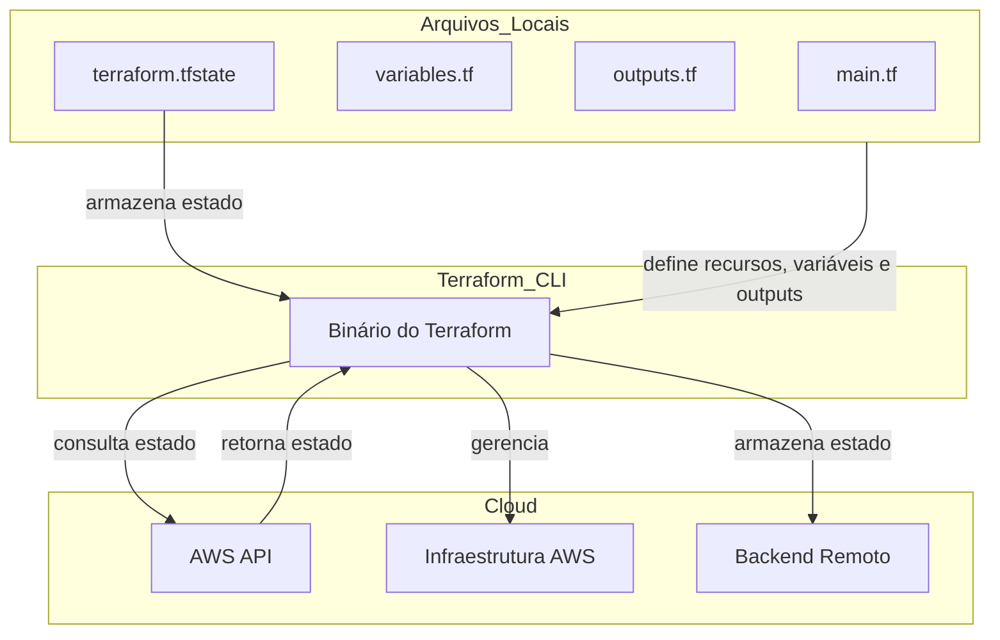

# Workshop Terraform

## Excalidraw

[Excalidraw](https://link.excalidraw.com/l/8pvW6zbNUnD/8ACp9pQ84Oz)

## O que é o Terraform

### Descrição da Estrutura:

1. **Arquivos Locais**:
    - `main.tf`: Define os recursos que serão gerenciados pelo Terraform.
    - `variables.tf`: Define as variáveis que podem ser usadas em `main.tf` e outros arquivos.
    - `outputs.tf`: Define os outputs que serão retornados após a aplicação das configurações.
    - `terraform.tfstate`: Armazena o estado atual da infraestrutura gerenciada pelo Terraform.

2. **Terraform CLI**:
    - Binário do Terraform que lê os arquivos `.tf`, aplica as configurações e gerencia o estado.

3. **Cloud**:
    - `AWS API`: Interface de programação de aplicativos que o Terraform usa para consultar o estado atual da infraestrutura na AWS.
    - `AWS Infrastructure`: Representa a infraestrutura na AWS gerenciada pelo Terraform.
    - `Remote Backend`: Pode ser usado para armazenar o estado do Terraform remotamente (ex.: S3, Azure Blob Storage, etc.).

### Processo de Funcionamento:

- Os arquivos locais (`main.tf`, `variables.tf`, `outputs.tf`) definem os recursos, variáveis e outputs para o Terraform.
- O arquivo `terraform.tfstate` armazena o estado atual da infraestrutura gerenciada.
- O Terraform Binary lê as definições dos arquivos locais e o estado armazenado.
- O Terraform consulta o estado atual da infraestrutura na cloud através da `AWS API`.
- Com base na comparação entre o estado armazenado e o estado atual consultado, o Terraform aplica as mudanças necessárias na `AWS Infrastructure`.
- O estado pode ser armazenado remotamente em um `Remote Backend` para facilitar a colaboração e a segurança.