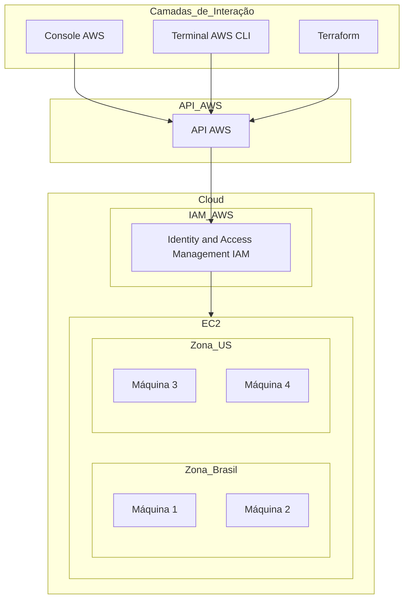
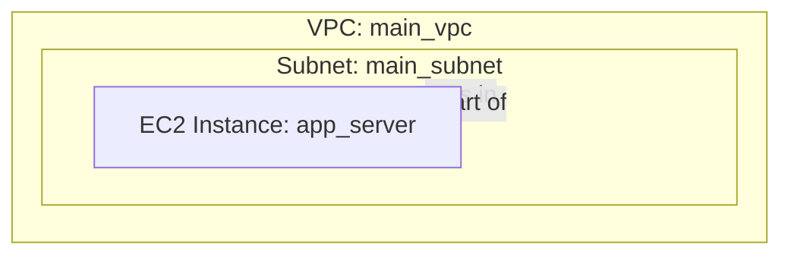

# Introdução à Cloud

## O que é Cloud?

A computação em nuvem, ou simplesmente "cloud", é a entrega de diferentes serviços pela internet. Esses serviços incluem armazenamento, bancos de dados, servidores, redes, software, entre outros. A cloud permite que empresas e indivíduos utilizem recursos de computação e armazenamento conforme necessário, pagando apenas pelo que usam, sem a necessidade de possuir e manter infraestrutura física.

### Vantagens da Computação em Nuvem

- **Escalabilidade:** Capacidade de aumentar ou diminuir recursos conforme a demanda.
- **Custo-Efetivo:** Pague apenas pelo que usa, eliminando a necessidade de grandes investimentos iniciais em hardware.
- **Acessibilidade:** Acesso a recursos e dados de qualquer lugar com uma conexão à internet.
- **Segurança:** Provedores de cloud oferecem altos níveis de segurança e conformidade com normas internacionais.

### Diagrama da Estrutura de Cloud com AWS



### Descrição do Diagrama

- **Cloud:** Representa a nuvem como um todo, onde os recursos são hospedados.
- **EC2 (Elastic Compute Cloud):** Serviço de computação em nuvem da AWS que oferece capacidade de processamento escalável.
  - **Zona Brasil:** Zona de disponibilidade que contém Máquinas 1 e 2.
  - **Zona US:** Zona de disponibilidade que contém Máquinas 3 e 4.
- **API AWS:** Interface de programação de aplicativos que permite interações automatizadas com os recursos AWS.
- **IAM (Identity and Access Management):** Serviço da AWS que controla o acesso aos recursos da AWS.
- **Camadas de Interação:** Diferentes formas de interagir e gerenciar os recursos na AWS.
  - **Console AWS:** Interface gráfica da AWS para gerenciar e visualizar recursos.
  - **Terminal AWS CLI:** Interface de linha de comando para gerenciar recursos AWS.
  - **Terraform:** Ferramenta de infraestrutura como código para provisionar e gerenciar recursos na AWS.

### Exemplos de Uso

1. **Escalabilidade com EC2:**
   - Suponha que sua aplicação precisa lidar com um aumento repentino de tráfego.
   - Com EC2, você pode facilmente aumentar a capacidade adicionando mais instâncias (máquinas virtuais) na zona Brasil ou na zona US.

2. **Automatização com Terraform:**
   - Utilizando o Terraform, você pode definir a infraestrutura necessária em arquivos de configuração.
   - Executando os comandos do Terraform, ele provisionará automaticamente os recursos na AWS conforme definido.

## Case AWS 01

### O que é uma VPC?

**Virtual Private Cloud (VPC)** é um serviço da Amazon Web Services (AWS) que permite a criação de uma rede virtual privada dentro da infraestrutura de nuvem da AWS. A VPC proporciona controle total sobre o ambiente de rede virtual, incluindo a seleção de intervalos de endereços IP, criação de sub-redes, configuração de tabelas de roteamento e gateways de rede.

#### Características da VPC

- **Isolamento:** Cada VPC é logicamente isolada de outras VPCs na nuvem da AWS.
- **Controle:** Proporciona controle total sobre a configuração de rede, permitindo definir endereços IP, criar sub-redes, configurar tabelas de roteamento e gateways de internet.
- **Segurança:** Suporte a grupos de segurança e listas de controle de acesso (ACLs) para gerenciar e controlar o tráfego de entrada e saída.

### O que é uma Sub-rede?

**Sub-rede** é uma divisão lógica de uma rede IP maior, como uma VPC. As sub-redes permitem a segmentação da rede em partes menores, facilitando a organização e a gestão dos recursos.

#### Características da Sub-rede

- **Segmentação:** Divide a VPC em áreas menores e gerenciáveis, cada uma com um intervalo de endereços IP específico.
- **Isolamento de Recursos:** Permite isolar recursos com diferentes requisitos de segurança e controle de acesso.
- **Roteamento:** Cada sub-rede pode ter suas próprias tabelas de roteamento, definindo como o tráfego deve ser direcionado.

### O que é EC2?

**Amazon Elastic Compute Cloud (EC2)** é um serviço da AWS que fornece capacidade de computação redimensionável na nuvem. Ele permite o provisionamento de instâncias de servidores virtuais, que podem ser configuradas e gerenciadas conforme as necessidades do usuário.

## Arquitetura



## Código Terraform

```hcl
terraform {
  required_providers {
    aws = {
      source  = "hashicorp/aws"
      version = "~> 4.16"
    }
  }

  required_version = ">= 1.2.0"
}

provider "aws" {
  region  = "us-west-2"
}

# Criação de uma nova VPC
resource "aws_vpc" "main" {
  cidr_block = "10.0.0.0/16"

  tags = {
    Name = "main_vpc"
  }
}

# Criação de uma sub-rede dentro da VPC
resource "aws_subnet" "main" {
  vpc_id            = aws_vpc.main.id
  cidr_block        = "10.0.1.0/24"
  availability_zone = "us-west-2a"

  tags = {
    Name = "main_subnet"
  }
}

# Criação de uma instância EC2 dentro da sub-rede criada
resource "aws_instance" "app_server" {
  ami           = "ami-830c94e3"
  instance_type = "t2.micro"
  subnet_id     = aws_subnet.main.id

  tags = {
    Name = "ExampleAppServerInstance"
  }
}
```

### Descrição das Modificações

1. **Criação de uma VPC:**
   - `aws_vpc` recurso para criar uma VPC com o bloco CIDR `10.0.0.0/16`.

2. **Criação de uma Sub-rede:**
   - `aws_subnet` recurso para criar uma sub-rede dentro da VPC com o bloco CIDR `10.0.1.0/24` na zona de disponibilidade `us-west-2a`.

3. **Especificação da Sub-rede na Instância EC2:**
   - `subnet_id` parâmetro adicionado ao recurso `aws_instance` para associar a instância à sub-rede criada.

### Comandos Terraform

#### Terraform Block

O bloco `terraform {}` contém configurações do Terraform, incluindo os provedores necessários que o Terraform usará para provisionar sua infraestrutura. Para cada provedor, o atributo `source` define um hostname opcional, um namespace e o tipo de provedor. O Terraform instala provedores do Terraform Registry por padrão. Nesta configuração de exemplo, a fonte do provedor `aws` é definida como `hashicorp/aws`, que é uma abreviação para `registry.terraform.io/hashicorp/aws`.

Você também pode definir uma restrição de versão para cada provedor definido no bloco `required_providers`. O atributo `version` é opcional, mas recomendamos usá-lo para restringir a versão do provedor para que o Terraform não instale uma versão que não funcione com sua configuração. Se você não especificar uma versão do provedor, o Terraform fará o download automático da versão mais recente durante a inicialização.

#### Providers

O bloco `provider` configura o provedor especificado, neste caso `aws`. Um provedor é um plugin que o Terraform usa para criar e gerenciar seus recursos.

Você pode usar múltiplos blocos de provedor em sua configuração Terraform para gerenciar recursos de diferentes provedores. Você pode até usar diferentes provedores juntos. Por exemplo, você pode passar o endereço IP da sua instância EC2 da AWS para um recurso de monitoramento do DataDog.

#### Resources

Use blocos `resource` para definir componentes de sua infraestrutura. Um recurso pode ser um componente físico ou virtual, como uma instância EC2, ou pode ser um recurso lógico, como uma aplicação Heroku.

Os blocos de recursos têm duas strings antes do bloco: o tipo de recurso e o nome do recurso. Neste exemplo, o tipo de recurso é `aws_instance` e o nome é `app_server`. O prefixo do tipo mapeia para o nome do provedor. Na configuração de exemplo, o Terraform gerencia o recurso `aws_instance` com o provedor `aws`. Juntos, o tipo de recurso e o nome formam um ID único para o recurso. Por

 exemplo, o ID para sua instância EC2 é `aws_instance.app_server`.

Os blocos de recursos contêm argumentos que você usa para configurar o recurso. Os argumentos podem incluir coisas como tamanhos de máquina, nomes de imagens de disco ou IDs de VPC. Nossa lista de provedores referencia os argumentos obrigatórios e opcionais para cada recurso. Para sua instância EC2, a configuração de exemplo define o ID do AMI como uma imagem do Ubuntu e o tipo de instância como `t2.micro`, que se qualifica para o nível gratuito da AWS. Também define uma tag para dar um nome à instância.

#### Inicializar o Diretório

Quando você cria uma nova configuração — ou verifica uma configuração existente a partir do controle de versão — você precisa inicializar o diretório com `terraform init`.

Inicializar um diretório de configuração faz o download e instala os provedores definidos na configuração, que neste caso é o provedor `aws`.

```sh
terraform init
```

#### Formatar e Validar a Configuração

Recomendamos usar formatação consistente em todos os seus arquivos de configuração. O comando `terraform fmt` atualiza automaticamente as configurações no diretório atual para legibilidade e consistência.

```sh
terraform fmt
```

Você também pode garantir que sua configuração seja sintaticamente válida e internamente consistente usando o comando `terraform validate`.

```sh
terraform validate
```

#### Criar Infraestrutura

Aplique a configuração agora com o comando `terraform apply`. O Terraform imprimirá um plano de execução que descreve as ações que o Terraform tomará para alterar sua infraestrutura para corresponder à configuração.

```sh
terraform apply
```

#### Inspecionar o Estado

Quando você aplica sua configuração, o Terraform grava dados em um arquivo chamado `terraform.tfstate`. O Terraform armazena os IDs e propriedades dos recursos que gerencia neste arquivo, para que possa atualizar ou destruir esses recursos no futuro.

Inspecione o estado atual usando `terraform show`.

```sh
terraform show
```

#### Gerenciar o Estado Manualmente

O Terraform tem um comando embutido chamado `terraform state` para gerenciamento avançado de estado. Use o subcomando `list` para listar os recursos no estado do seu projeto.

```sh
terraform state list
```

### Modificar Infraestrutura

A infraestrutura está em constante evolução, e o Terraform ajuda você a gerenciar essas mudanças. Ao modificar configurações do Terraform, ele cria um plano de execução que altera apenas o necessário para alcançar o estado desejado.

#### Código Modificado

```hcl
terraform {
  required_providers {
    aws = {
      source  = "hashicorp/aws"
      version = "~> 4.16"
    }
  }
  required_version = ">= 1.2.0"
}

provider "aws" {
  region  = "us-west-2"
}

# Criação de uma nova VPC
resource "aws_vpc" "main" {
  cidr_block = "10.0.0.0/16"
  tags = {
    Name = "main_vpc"
  }
}

# Criação de uma sub-rede dentro da VPC
resource "aws_subnet" "main" {
  vpc_id            = aws_vpc.main.id
  cidr_block        = "10.0.1.0/24"
  availability_zone = "us-west-2a"
  tags = {
    Name = "main_subnet"
  }
}

# Criação de uma instância EC2 dentro da sub-rede criada
resource "aws_instance" "app_server" {
  ami           = "ami-08d70e59c07c61a3a"
  instance_type = "t2.micro"
  subnet_id     = aws_subnet.main.id
  tags = {
    Name = "ExampleAppServerInstance"
  }
}
```

1. **Inicialize a Configuração**

```sh
terraform init
```

2. **Aplique a Configuração**

```sh
terraform apply
```

Após aplicar com sucesso a configuração inicial, você pode continuar com as modificações.

#### Modificar a Configuração

Atualize o AMI da sua instância. Altere o recurso `aws_instance.app_server` substituindo o ID do AMI atual por um novo.

```diff
 resource "aws_instance" "app_server" {
-  ami           = "ami-830c94e3"
+  ami           = "ami-08d70e59c07c61a3a"
   instance_type = "t2.micro"
 }
```

#### Aplicar Mudanças

Depois de alterar a configuração, execute `terraform apply` novamente para ver como o Terraform aplicará essa mudança aos recursos existentes.

Esses passos e código atualizado mostram como modificar a infraestrutura existente usando o Terraform, garantindo que apenas as mudanças necessárias sejam aplicadas para alcançar o estado desejado.

### Destruir Infraestrutura com Terraform

Agora que você criou e atualizou uma instância EC2 na AWS com Terraform, vamos aprender a destruir essa infraestrutura.

Quando você não precisar mais da infraestrutura, pode ser desejável destruí-la para reduzir a exposição a riscos de segurança e custos. Por exemplo, você pode remover um ambiente de produção do serviço ou gerenciar ambientes de curta duração, como sistemas de compilação ou teste. Além de construir e modificar a infraestrutura, o Terraform também pode destruir ou recriar a infraestrutura que ele gerencia.

#### Destruir Infraestrutura

O comando `terraform destroy` termina os recursos gerenciados pelo seu projeto Terraform. Este comando é o inverso do `terraform apply`, pois termina todos os recursos especificados no estado do Terraform. Ele não destrói recursos que estão sendo executados em outros lugares e que não são gerenciados pelo projeto Terraform atual.

#### Passos para Destruir Recursos

1. **Destruir Recursos**

Execute o comando para destruir os recursos que você criou:

```sh
terraform destroy
```

2. **Confirme a Destruição**

O Terraform mostrará um plano de execução que descreve as ações que serão tomadas para destruir a infraestrutura. Confirme a execução digitando `yes` quando solicitado.

```sh
Do you really want to destroy all resources?
Terraform will destroy all your managed infrastructure, as shown above.
There is no undo. Only 'yes' will be accepted to confirm.

Enter a value: yes
```

### Define Input Variables

Agora que você já tem conhecimento suficiente sobre o Terraform para criar configurações úteis, vamos tornar nossa configuração mais dinâmica e flexível utilizando variáveis.

#### Pré-requisitos

Após seguir os tutoriais anteriores, você deve ter um diretório chamado `learn-terraform-aws-instance` com a seguinte configuração em um arquivo chamado `main.tf`.

```hcl
terraform {
  required_providers {
    aws = {
      source  = "hashicorp/aws"
      version = "~> 4.16"
    }
  }
  required_version = ">= 1.2.0"
}

provider "aws" {
  region  = "us-west-2"
}

resource "aws_instance" "app_server" {
  ami           = "ami-08d70e59c07c61a3a"
  instance_type = "t2.micro"
  tags = {
    Name = "ExampleAppServerInstance"
  }
}
```

### Definindo Variáveis de Entrada

A configuração atual inclui vários valores fixos. As variáveis do Terraform permitem que você escreva configurações mais flexíveis e fáceis de reutilizar.

#### Criar Variável para Nome da Instância

Adicione uma variável para definir o nome da instância.

Crie um novo arquivo chamado `variables.tf` com um bloco definindo uma nova variável `instance_name`.

```hcl
variable "instance_name" {
  description = "Value of the Name tag for the EC2 instance"
  type        = string
  default     = "ExampleAppServerInstance"
}
```

O Terraform carrega todos os arquivos no diretório atual que terminam em `.tf`, portanto, você pode nomear seus arquivos de configuração como preferir.

#### Atualizar `main.tf`

No arquivo `main.tf`, atualize o bloco do recurso `aws_instance` para usar a nova variável. O bloco da variável `instance_name` usará seu valor padrão ("ExampleAppServerInstance") a menos que você declare um valor diferente.

```hcl
resource "aws_instance" "app_server" {
  ami           = "ami-08d70e59c07c61a3a"
  instance_type = "t2.micro"
  tags = {
    Name = var.instance_name
  }
}
```

### Aplicar a Configuração

1. **Inicialize a Configuração**

```sh
terraform init
```

2. **Aplique a Configuração**

```sh
terraform apply
```

Responda ao prompt de confirmação com `yes`.

O Terraform criará a instância EC2 com o nome definido na variável `instance_name`.

### Sobrescrever Variável na Linha de Comando

Aplique a configuração novamente, desta vez sobrescrevendo o nome padrão da instância passando uma variável com o flag `-var`.

```sh
terraform apply -var "instance_name=YetAnotherName"
```

Responda ao prompt de confirmação com `yes`. O Terraform atualizará a tag `Name` da instância com o novo nome.