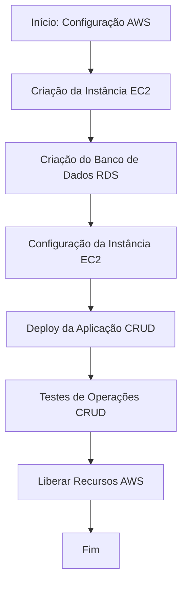

Aqui está um README detalhado para a Parte 1 do workshop, explicando o passo a passo para criar uma aplicação na AWS do zero, utilizando EC2 e um banco de dados, com um CRUD simples:

---

# Terraform Workshop - Parte 1: Deploy de uma Aplicação CRUD na AWS

## Objetivo

Nesta primeira parte do workshop, você aprenderá a criar uma aplicação CRUD simples na AWS do zero, utilizando uma instância EC2 e um banco de dados relacional (RDS). Este guia irá levá-lo através do processo de configuração da infraestrutura manualmente, incluindo a criação de uma instância EC2, configuração do banco de dados e deploy da aplicação.

## Passo a Passo

### 1. Criando a Infraestrutura na AWS

#### 1.1. Criar uma Instância EC2

1. **Acesse o Console da AWS** e vá para o serviço **EC2**.
2. **Lançar uma Instância**:
   - **Nome da Instância**: `crud-app-instance`.
   - **AMI**: Escolha uma Amazon Linux 2 ou Ubuntu 20.04 LTS.
   - **Tipo de Instância**: `t2.micro` (se estiver no Free Tier).
   - **Par de Chaves**: Selecione um par de chaves existente ou crie um novo para acessar a instância via SSH.
   - **Configurações de Rede**: Crie ou selecione um VPC e Subnet. Garanta que a instância tenha um IP público.
   - **Configurações de Segurança**: 
     - Crie ou selecione um grupo de segurança com as seguintes regras:
       - Porta 22 (SSH): Permitir acesso de qualquer IP (`0.0.0.0/0`).
       - Porta 80 (HTTP): Permitir acesso de qualquer IP (`0.0.0.0/0`).
       - Porta 3306 (MySQL) ou 5432 (PostgreSQL): Permitir acesso de qualquer IP (`0.0.0.0/0`).
   - **Configurações de Armazenamento**: Use o padrão de 8 GB para o disco.

3. **Revisar e Lançar a Instância**. Aguarde até que a instância esteja em execução.

#### 1.2. Configurar o Banco de Dados RDS

1. **Acesse o Console da AWS** e vá para o serviço **RDS**.
2. **Criar uma Instância de Banco de Dados**:
   - **Nome do Banco de Dados**: `crud_app_db`.
   - **Engine**: Escolha MySQL ou PostgreSQL.
   - **Tipo de Instância**: `db.t2.micro` (se estiver no Free Tier).
   - **Credenciais de Acesso**:
     - **Username**: `admin`.
     - **Password**: Defina uma senha segura.
   - **Configurações de Rede**: Garanta que o banco de dados esteja na mesma VPC da instância EC2.
   - **Configurações de Conectividade**: 
     - **Acesso Público**: Marque como "Sim" para permitir acesso externo (não recomendado para produção).
     - **Grupo de Segurança**: Use o mesmo grupo de segurança que foi configurado para a instância EC2.
   - **Configurações de Banco de Dados**:
     - **DB Name**: `crud_app`.
     - **Storage**: 20 GB (pode ajustar conforme necessário).

3. **Revisar e Criar a Instância de Banco de Dados**. Aguarde até que o banco de dados esteja disponível.

### 2. Preparando o Ambiente na Instância EC2

#### 2.1. Conectar à Instância EC2 via SSH

1. **Conecte-se à Instância EC2**:
   - Utilize o seguinte comando no terminal, substituindo `your-key.pem` pelo nome da chave que você configurou:
     ```bash
     ssh -i "your-key.pem" ec2-user@<EC2-Public-IP>
     ```

#### 2.2. Instalar as Dependências Necessárias

1. **Atualize os pacotes e instale o Git**:
   ```bash
   sudo yum update -y
   sudo yum install git -y
   ```

2. **Instalar Docker e Docker Compose**:
   ```bash
   sudo yum install -y docker
   sudo service docker start
   sudo usermod -a -G docker ec2-user
   sudo curl -L "https://github.com/docker/compose/releases/download/$(curl -s https://api.github.com/repos/docker/compose/releases/latest | grep -oP '"tag_name": "\K(.*)(?=")')" -o /usr/local/bin/docker-compose
   sudo chmod +x /usr/local/bin/docker-compose
   ```

3. **Clone o Repositório da Aplicação**:
   ```bash
   git clone https://github.com/seu-usuario/seu-repositorio-crud.git
   cd seu-repositorio-crud
   ```

### 3. Configurando a Aplicação

#### 3.1. Configurar o Banco de Dados

1. **Atualize as configurações de banco de dados**:
   - No arquivo `.env` ou `settings.py` da aplicação, atualize as credenciais para se conectar ao RDS:
     ```bash
     DB_HOST=<RDS-Endpoint>
     DB_USER=admin
     DB_PASS=<Your-Password>
     DB_NAME=crud_app
     ```

#### 3.2. Subir a Aplicação

1. **Criar e iniciar os contêineres**:
   ```bash
   sudo docker-compose up -d
   ```

2. **Verifique se a aplicação está em execução**:
   - Acesse `http://<EC2-Public-IP>` no navegador para visualizar a aplicação.

### 4. Testando a Aplicação CRUD

1. **Realize operações CRUD**:
   - Utilize ferramentas como Postman ou CURL para realizar operações de Create, Read, Update, e Delete na API exposta.

2. **Verifique o Banco de Dados**:
   - Conecte-se ao RDS através de uma ferramenta como DBeaver ou MySQL Workbench e verifique se os dados estão sendo salvos corretamente.

### 5. Encerrando e Limpando os Recursos

1. **Parar e Remover os Contêineres**:
   ```bash
   sudo docker-compose down
   ```

2. **Terminar a Instância EC2**:
   - No console da AWS, selecione a instância EC2 e clique em "Terminate".

3. **Excluir o Banco de Dados RDS**:
   - No console da AWS, selecione a instância do banco de dados RDS e clique em "Delete".

## Diagrama de Fluxo (Mermaid)

Aqui está um diagrama de fluxo que ilustra o processo de deploy da aplicação CRUD na AWS:

