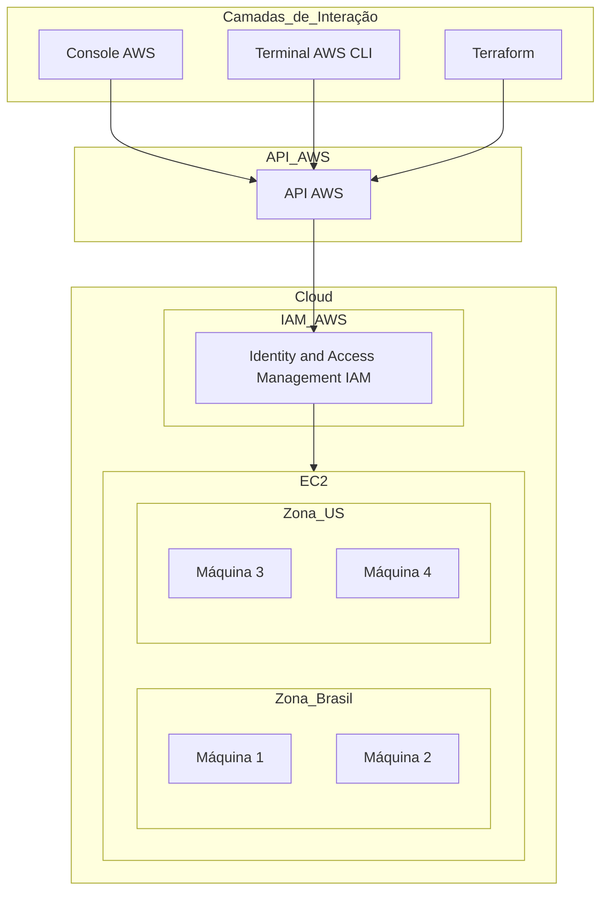

# Introdução à Cloud

## O que é Cloud?

A computação em nuvem, ou simplesmente "cloud", é a entrega de diferentes serviços pela internet. Esses serviços incluem armazenamento, bancos de dados, servidores, redes, software, entre outros. A cloud permite que empresas e indivíduos utilizem recursos de computação e armazenamento conforme necessário, pagando apenas pelo que usam, sem a necessidade de possuir e manter infraestrutura física.

### Vantagens da Computação em Nuvem

- **Escalabilidade:** Capacidade de aumentar ou diminuir recursos conforme a demanda.
- **Custo-Efetivo:** Pague apenas pelo que usa, eliminando a necessidade de grandes investimentos iniciais em hardware.
- **Acessibilidade:** Acesso a recursos e dados de qualquer lugar com uma conexão à internet.
- **Segurança:** Provedores de cloud oferecem altos níveis de segurança e conformidade com normas internacionais.

### Diagrama da Estrutura de Cloud com AWS



# Terraform para Engenharia de Dados

## Introdução

Terraform é uma ferramenta de **infraestrutura como código** que permite construir, alterar e gerenciar a infraestrutura de maneira eficiente e segura através de código. Com o Terraform, você pode definir o estado desejado da infraestrutura e deixar que a ferramenta cuide da criação e gerenciamento desses recursos.

## Principais Características

- **Infraestrutura como Código**: Defina o estado final, declarativo, desejado da infraestrutura em vez de descrever cada passo individualmente.
- **Versionamento**: Acompanhe a evolução da infraestrutura e faça o versionamento das configurações.
- **Automação**: Automatize a criação e a gestão da infraestrutura.
- **Compartilhamento e Colaboração**: Compartilhe e colabore facilmente com outras pessoas.
- **Imutabilidade**: Evita a criação de recursos duplicados e garante que os recursos sejam criados ou alterados de forma correta.
- **Plano de Execução**: Permite planejar e revisar alterações antes de aplicá-las.
- **Agnóstico ao Provedor**: Suporte a múltiplos provedores de nuvem, como AWS, Azure, e Google Cloud.

## Casos de Uso

- **Criação de Infraestrutura**: Provisionar novos recursos de infraestrutura.
- **Gerenciamento de Infraestrutura**: Gerenciar e modificar recursos existentes.
- **Replicação de Infraestrutura**: Copiar recursos de um ambiente para outro, como de desenvolvimento para produção.

## Como Funciona

1. **Configuração**: Crie arquivos de configuração em código que definem o estado desejado da sua infraestrutura.
2. **Providers**: São as integrações com os fornecedores de recursos.
   - IaaS: AWS, GCP, Azure
   - PaaS: Kubernetes, Heroku, DigitalOcean
   - SaaS: New Relic

# Guia de Instalação do Terraform

## Introdução

Terraform é uma ferramenta de infraestrutura como código que permite definir e provisionar infraestrutura através de código. Siga os passos abaixo para instalar o Terraform em seu sistema.

## Requisitos

- Sistema Operacional: Windows, macOS ou Linux.
- Acesso à internet para baixar o Terraform.

## Passos para Instalação

### 1. Baixar o Terraform

#### Windows

1. Acesse a [página de downloads do Terraform](https://www.terraform.io/downloads).
2. Clique em "Windows" e baixe o arquivo ZIP correspondente à versão mais recente.
3. Extraia o arquivo ZIP em um diretório de sua escolha, por exemplo, `C:\Program Files\Terraform`.

#### macOS

1. Acesse a [página de downloads do Terraform](https://www.terraform.io/downloads).
2. Clique em "macOS" e baixe o arquivo `.zip`.
3. Extraia o arquivo `.zip` e mova o binário `terraform` para um diretório de sua escolha, por exemplo, `/usr/local/bin`.

#### Linux

1. Acesse a [página de downloads do Terraform](https://www.terraform.io/downloads).
2. Clique em "Linux" e baixe o arquivo `.zip`.
3. Extraia o arquivo `.zip` e mova o binário `terraform` para um diretório no seu `PATH`, por exemplo, `/usr/local/bin`.

   ```bash
   unzip terraform_1.5.2_linux_amd64.zip
   sudo mv terraform /usr/local/bin/
   ```

### 2. Verificar a Instalação

Após a instalação, verifique se o Terraform está corretamente instalado:

```bash
terraform --version
```

Você deve ver a versão do Terraform que foi instalada.

### 3. Configurar o PATH (se necessário)

#### Windows

- Adicione o diretório onde o Terraform foi extraído ao PATH do sistema:
  1. Clique com o botão direito no ícone do Windows e selecione "Sistema".
  2. Clique em "Configurações avançadas do sistema".
  3. Clique no botão "Variáveis de ambiente".
  4. Em "Variáveis de sistema", selecione "Path" e clique em "Editar".
  5. Adicione o caminho do diretório onde o Terraform foi extraído e clique em "OK".

#### macOS e Linux

- Verifique se o diretório `/usr/local/bin` (ou onde o `terraform` foi movido) está incluído no PATH. Você pode adicionar isso ao seu perfil de shell:

  ```bash
  export PATH=$PATH:/usr/local/bin
  ```

  Adicione a linha acima ao seu arquivo de perfil, como `~/.bashrc`, `~/.zshrc`, ou `~/.bash_profile`, e recarregue o perfil:

  ```bash
  source ~/.bashrc
  ```

## Recursos Adicionais

- [Documentação Oficial do Terraform](https://www.terraform.io/docs)
- [Guia de Início Rápido](https://learn.hashicorp.com/collections/terraform/aws-get-started)

# Integração do Terraform com a AWS

Este guia irá guiá-lo através da configuração do AWS CLI e do Terraform para trabalhar com a AWS.

## Requisitos

- Terraform instalado.
- AWS CLI instalado.
- Conta na AWS.

## Passo 1: Criar um Usuário IAM com Permissões de Administrador

### 1.1. Acessar o Console da AWS

1. Faça login no [Console de Gerenciamento da AWS](https://aws.amazon.com/console/).
2. Navegue até o serviço **IAM** (Identity and Access Management).

### 1.2. Criar um Novo Usuário

1. No painel de navegação à esquerda, selecione **Users** e clique em **Add user**.
2. Insira um nome de usuário (por exemplo, `terraform-user`).
3. Selecione **Access key - Programmatic access** para gerar credenciais de acesso para o AWS CLI e SDKs.
4. Clique em **Next: Permissions**.

### 1.3. Atribuir Permissões de Administrador

1. Selecione a opção **Attach policies directly**.
2. Marque a política **AdministratorAccess**.
3. Clique em **Next: Tags** e adicione tags, se desejar.
4. Clique em **Next: Review** e depois em **Create user**.

### 1.4. Anotar Credenciais

Após a criação do usuário, anote a **Access key ID** e a **Secret access key**. Esses são necessários para a configuração do AWS CLI.

## Passo 2: Configurar o AWS CLI

### 2.1. Instalar o AWS CLI

Se ainda não tiver o AWS CLI instalado, siga as instruções para a instalação:

- **Windows**: Baixe o instalador do [AWS CLI Installer para Windows](https://docs.aws.amazon.com/cli/latest/userguide/install-cliv2-windows.html) e siga as instruções.
- **macOS**: Use o Homebrew para instalar o AWS CLI:

  ```bash
  brew install awscli
  ```
- **Linux**: Use o gerenciador de pacotes apropriado para sua distribuição ou siga as instruções de [instalação para Linux](https://docs.aws.amazon.com/cli/latest/userguide/install-cliv2-linux.html).

### 2.2. Configurar o AWS CLI

Após a instalação, configure o AWS CLI com suas credenciais:

```bash
aws configure
```

Você será solicitado a fornecer:

- **AWS Access Key ID**: (Obtenha essas credenciais ao criar um usuário IAM na AWS)
- **AWS Secret Access Key**: (Obtenha essas credenciais ao criar um usuário IAM na AWS)
- **Default region name**: (Exemplo: `us-east-1`)
- **Default output format**: (Exemplo: `json`)

As credenciais serão armazenadas em `~/.aws/credentials` e a configuração em `~/.aws/config`.

## Passo 3: Criar e Configurar um Bucket S3

### 3.1. O Que É um Bucket S3?

Um **bucket S3** é um container para armazenar objetos no Amazon S3 (Simple Storage Service). Cada bucket pode conter múltiplos objetos e é usado para organizar e acessar dados armazenados.

### 3.2. Criar um Bucket S3 no Console da AWS

1. Acesse o [Console de Gerenciamento da AWS](https://aws.amazon.com/console/).
2. Navegue até o serviço **S3**.
3. Clique em **Create bucket**.
4. Insira um nome exclusivo para o bucket e selecione a região onde o bucket será criado.
5. Configure opções adicionais, como permissões e configurações de versão, conforme necessário.
6. Clique em **Create bucket**.

### 3.3. Configurar um Bucket S3 com Terraform

Crie um arquivo de configuração do Terraform, por exemplo, `main.tf`, com o seguinte conteúdo:

```hcl
provider "aws" {
  region = "us-east-1"  # Substitua pela região desejada
}

resource "aws_s3_bucket" "example" {
  bucket = "my-unique-bucket-name-2476238482723"  # Substitua por um nome único
  acl    = "private"

  tags = {

    Name = "Meu bucket pelo terraform"

  }
}
```

No diretório onde você criou o arquivo `main.tf`, execute:

```bash
terraform init
```

Para validar a configuração:

```bash
terraform validate
terraform fmt
```

Para gerar um plano e aplicar a configuração:

```bash
terraform plan
terraform apply
```

Revise as alterações e confirme para criar o bucket S3.

Para deletar o bucket

```bash
terraform destroy
```

## Passo 4: Recriando o Bucket e alterando o nome

```bash
terraform apply
```

Alterar o nome

```bash
terraform apply
```

## Conclusão

Com Terraform, você pode gerenciar a infraestrutura de forma mais eficiente e segura, além de facilitar a automação e a colaboração. A integração com a AWS é uma das muitas possibilidades que o Terraform oferece, permitindo provisionar e gerenciar recursos com facilidade.
