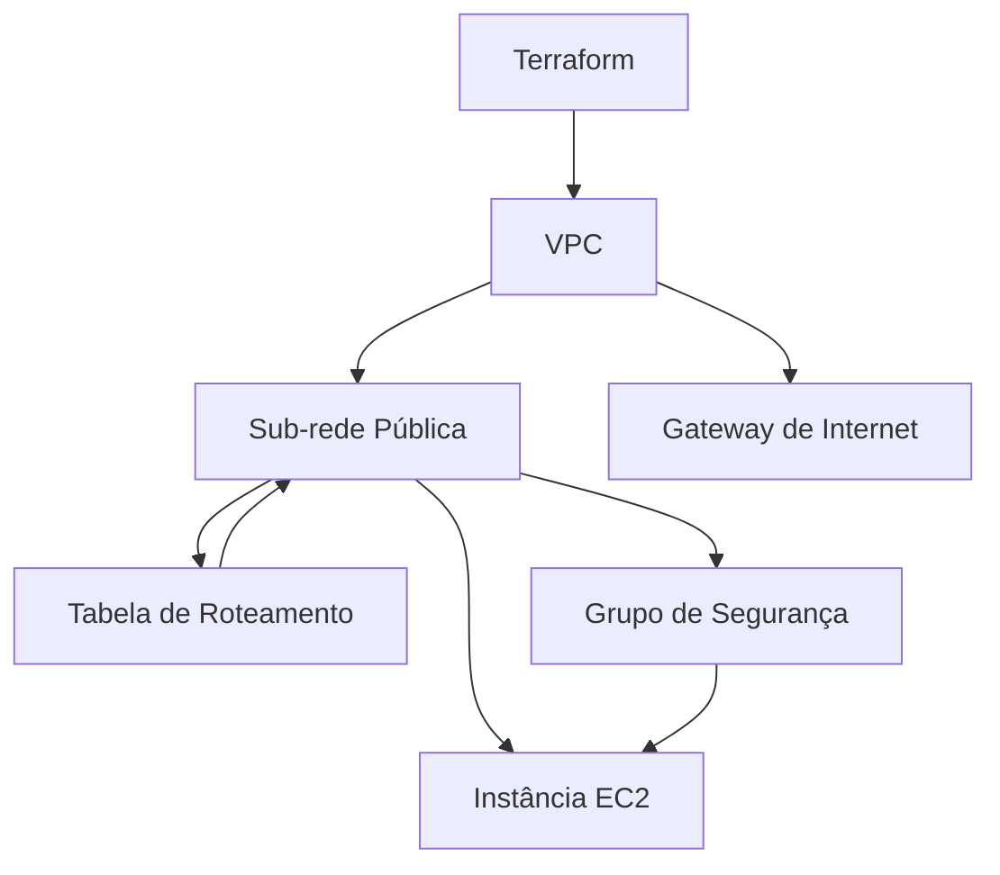

# Terraform Streamlit Deployment

Este projeto usa Terraform para configurar e implantar uma aplicação Streamlit em uma instância EC2 na AWS. Ele cria toda a infraestrutura necessária, incluindo uma VPC, sub-rede pública, gateway de internet, tabela de roteamento, grupo de segurança e a instância EC2.

## Requisitos

- Conta na AWS
- Terraform instalado
- Chave SSH configurada para acessar a instância EC2

## Arquivos do Projeto

- `main.tf`: Configuração principal do Terraform.
- `vpc.tf`: Configuração da VPC, sub-rede pública, gateway de internet e tabela de roteamento.
- `security_group.tf`: Configuração do grupo de segurança.
- `ec2.tf`: Configuração da instância EC2 e script de inicialização.

## Por que precisamos de uma VPC?

Uma VPC (Virtual Private Cloud) é uma rede virtual dedicada à sua conta AWS. Ela permite que você isole e controle completamente o ambiente de rede de suas instâncias EC2. Pense na VPC como uma casa com várias salas (sub-redes), onde você pode controlar quem entra e quem sai, garantindo que seus recursos estejam seguros e bem organizados.

## Por que precisamos de um Grupo de Segurança?

O grupo de segurança funciona como uma "parede de segurança" ao redor da sua instância EC2. Ele define as regras de entrada e saída para controlar o tráfego de rede. Sem um grupo de segurança, sua instância estaria vulnerável a acessos indesejados. No nosso projeto, configuramos o grupo de segurança para permitir o acesso SSH (porta 22) e HTTP (porta 8501) para a aplicação Streamlit.

## Estrutura do Projeto

Aqui está um gráfico em Mermaid para visualizar a infraestrutura:



## Passos para Implantação

1. **Clone o Repositório:**

   ```sh
   git clone https://github.com/lvgalvao/terraform-streamlit.git
   cd terraform-streamlit
   ```

2. **Inicialize o Terraform:**

   ```sh
   terraform init
   ```

3. **Planeje a Infraestrutura:**

   ```sh
   terraform plan
   ```

4. **Aplique a Configuração:**

   ```sh
   terraform apply
   ```

5. **Acesse a Aplicação:**

   Use o endereço IP público exibido no output do Terraform para acessar a aplicação Streamlit no navegador:

   ```
   http://<instance_public_ip>:8501
   ```

## Arquivos de Configuração

### `main.tf`

```hcl
terraform {
  required_providers {
    aws = {
      source  = "hashicorp/aws"
    }
  }
}

provider "aws" {
  region = "us-east-1"
}
```

### `vpc.tf`

```hcl
resource "aws_vpc" "main" {
  cidr_block = "10.0.0.0/16"

  tags = {
    Name = "main_vpc"
  }
}

resource "aws_subnet" "public" {
  vpc_id     = aws_vpc.main.id
  cidr_block = "10.0.1.0/24"
  map_public_ip_on_launch = true

  tags = {
    Name = "public_subnet"
  }
}

resource "aws_internet_gateway" "gw" {
  vpc_id = aws_vpc.main.id

  tags = {
    Name = "main_gw"
  }
}

resource "aws_route_table" "public" {
  vpc_id = aws_vpc.main.id

  route {
    cidr_block = "0.0.0.0/0"
    gateway_id = aws_internet_gateway.gw.id
  }

  tags = {
    Name = "public_rt"
  }
}

resource "aws_route_table_association" "a" {
  subnet_id      = aws_subnet.public.id
  route_table_id = aws_route_table.public.id
}
```

### `security_group.tf`

```hcl
resource "aws_security_group" "allow_ssh_http" {
  vpc_id = aws_vpc.main.id

  ingress {
    from_port   = 22
    to_port     = 22
    protocol    = "tcp"
    cidr_blocks = ["0.0.0.0/0"]
  }

  ingress {
    from_port   = 8501
    to_port     = 8501
    protocol    = "tcp"
    cidr_blocks = ["0.0.0.0/0"]
  }

  egress {
    from_port   = 0
    to_port     = 0
    protocol    = "-1"
    cidr_blocks = ["0.0.0.0/0"]
  }

  tags = {
    Name = "allow_ssh_http"
  }
}
```

### `ec2.tf`

```hcl
data "aws_ami" "ubuntu" {
  most_recent = true

  filter {
    name   = "name"
    values = ["ubuntu/images/hvm-ssd/ubuntu-focal-20.04-amd64-server-*"]
  }

  owners = ["099720109477"] # Ubuntu
}

resource "aws_instance" "web" {
  ami           = data.aws_ami.ubuntu.id
  instance_type = "t2.micro"
  subnet_id     = aws_subnet.public.id
  vpc_security_group_ids = [aws_security_group.allow_ssh_http.id]

  tags = {
    Name = "HelloStreamlit"
  }

  user_data = <<-EOF
              #!/bin/bash
              sudo apt-get update
              sudo apt-get install -y docker.io git
              sudo systemctl start docker
              sudo systemctl enable docker

              # Clonar o repositório do GitHub
              git clone https://github.com/lvgalvao/terraform-streamlit.git /app

              # Construir e executar o contêiner Docker
              cd /app
              sudo docker build -t streamlit-app .
              sudo docker run -d -p 8501:8501 streamlit-app
              EOF
}

output "instance_public_ip" {
  value = aws_instance.web.public_ip
}
```

### Conclusão

Este projeto demonstra como usar Terraform para configurar uma infraestrutura AWS e implantar uma aplicação Streamlit em uma instância EC2. Seguindo os passos acima, você poderá acessar e interagir com sua aplicação Streamlit na AWS.