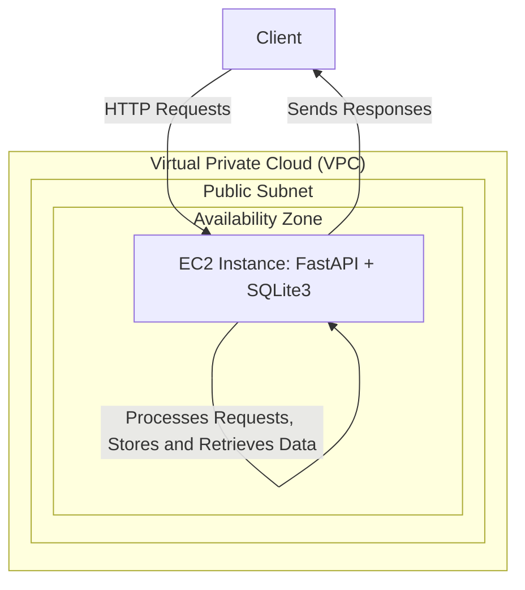
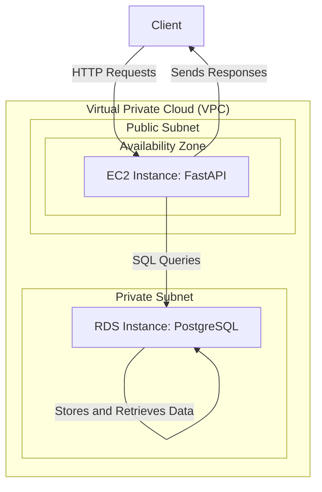

# FastAPI Docker Project

Este projeto demonstra como configurar e rodar uma aplicação FastAPI simples dentro de um contêiner Docker. Ele inclui instruções completas para configurar uma instância EC2 na AWS, clonar o repositório, construir a imagem Docker, e rodar o contêiner.

## Pré-requisitos

- Uma conta AWS com permissões para criar instâncias EC2.
- Conhecimento básico de Docker e FastAPI.

## Objetivo

Subir uma aplicação de FastAPI usando um Sqlite3 em uma máquina EC2



## Passo a Passo

### 0. Crie um repo novo clonando a aula 19

- Crie um repo novo
- Configure o Pyenv 3.12.3
- Crie o .gitignore
- Crie os arquivos do CRUD
- Crie o Dockerfile

Se quiser testar local

```bash
docker build -t fastapi-app .
```

```bash
docker run -p 8000:8000 fastapi-app
```

### 1. Configurar uma Instância EC2 na AWS

1. **Acesse o AWS Management Console**: Vá para [AWS Management Console](https://aws.amazon.com/console/) e faça login.
2. **Lance uma Instância EC2**:
   - **Escolha a AMI**: Selecione **Amazon Linux 2023**.
   - **Escolha o Tipo de Instância**: Selecione `t2.micro` (grátis elegível para o nível gratuito da AWS).
   - **Configurar Regras de Segurança**:
     - **SSH**: Porta 22.
     - **Adicionar Regra**:
       - **Tipo**: Custom TCP Rule.
       - **Porta**: 8000 (porta para FastAPI).
       - **Source**: Anywhere (0.0.0.0/0) para permitir acesso de qualquer lugar.
   - **Lance a Instância**: Revise e inicie a instância, escolhendo um par de chaves para acesso SSH.

### 2. Acessar a Instância EC2 via AWS Connect

Va até a aba 'EC2 Instance Connect' e clique em 'Connect'

### 3. Atualizar o Sistema

```bash
sudo dnf update -y
```

### 4. Instalar Git

```bash
sudo dnf install git -y
```

### 5. Clonar o Repositório

```bash
git clone https://github.com/lvgalvao/fastapi-deploy-ec2
ls
```

### 6. Instalar Docker

```bash
sudo dnf install docker -y
```

### 7. Iniciar e Habilitar o Docker

```bash
sudo systemctl start docker
sudo systemctl enable docker
sudo usermod -aG docker ec2-user
```

### 8. Reiniciar a Sessão SSH

```bash
exit
```

Reconecte-se à instância

```bash
cd fastapi-deploy-ec2
```

### 9. Construir a Imagem Docker

```bash
docker build -t fastapi-app .
```

### 10. Executar o Contêiner Docker

```bash
docker run -p 80:80 fastapi-app
```

### 11. Acessar a Aplicação FastAPI

No seu navegador, acesse o aplicativo usando o IP público da instância EC2 na porta 8000:

```
http://<seu-endereco-ip>:8000/
```

## Refatorando

Para atender ao novo requisito de separar a aplicação FastAPI e usar um banco de dados PostgreSQL no Amazon RDS, você precisará seguir alguns passos para configurar a infraestrutura e modificar a aplicação FastAPI para se conectar ao PostgreSQL em vez de usar o SQLite localmente. Aqui está o passo a passo completo:



### 1. **Configurar o Banco de Dados PostgreSQL no Amazon RDS**

#### 1.1. **Crie uma Instância RDS PostgreSQL**

1. **Acesse o AWS Management Console** e navegue até **RDS**.
2. **Clique em "Create database"** (Criar banco de dados).
3. **Selecione "Standard Create"**.
4. **Escolha o mecanismo de banco de dados**: Selecione **PostgreSQL**.
5. **Versão do PostgreSQL**: Selecione a versão desejada.
6. **Configurações da Instância**:
   - **Classe de Instância**: Escolha uma classe de instância (por exemplo, `db.t3.micro` para o nível gratuito).
   - **Identificador da Instância**: Dê um nome para o seu banco de dados.
   - **Usuário Mestre e Senha**: Defina o usuário e senha para acessar o banco de dados.
7. **Configurações de Conectividade**:
   - **VPC**: Selecione a mesma VPC onde a sua instância EC2 está localizada.
   - **Subrede**: Escolha uma subrede pública ou privada, dependendo das suas necessidades.
   - **Grupo de Segurança**: Configure um grupo de segurança que permita a conexão à porta 5432 (porta padrão do PostgreSQL) a partir da sua instância EC2.
8. **Configurações Adicionais**:
   - **Autenticação de Banco de Dados**: Deixe as configurações padrão ou ajuste conforme necessário.
9. **Clique em "Create Database"** (Criar Banco de Dados).

#### 1.2. **Configurar o Grupo de Segurança**

1. Navegue até o **EC2 > Security Groups** (Grupos de Segurança).
2. Encontre o grupo de segurança associado à sua instância RDS e clique em **Edit Inbound Rules** (Editar Regras de Entrada).
3. **Adicione uma nova regra**:
   - **Tipo**: PostgreSQL.
   - **Porta**: 5432.
   - **Source**: O grupo de segurança associado à sua instância EC2 (ou `0.0.0.0/0` para permitir acesso de qualquer lugar, mas isso é menos seguro).
4. Salve as alterações.

### 2. **Modificar a Aplicação FastAPI para Usar PostgreSQL**

#### 2.1. **Atualizar as Dependências no `requirements.txt`**

Certifique-se de incluir a biblioteca `asyncpg` para conectar-se ao PostgreSQL de forma assíncrona com SQLAlchemy:

```text
fastapi
uvicorn
sqlalchemy
psycopg2-binary
```

#### 2.2. **Configurar SQLAlchemy para Conectar ao PostgreSQL**

Modifique o código da aplicação FastAPI para usar SQLAlchemy com PostgreSQL:

**`main.py`**:

```python
from fastapi import FastAPI
from sqlalchemy.ext.asyncio import AsyncSession, create_async_engine
from sqlalchemy.orm import sessionmaker
from sqlalchemy.ext.declarative import declarative_base

import os

SQLALCHEMY_DATABASE_URL = os.getenv("DATABASE_URL")
```

- Substitua `<username>`, `<password>`, `<rds-endpoint>` e `<database-name>` pelos detalhes do seu banco de dados RDS.


#### 2.3. **Atualizar o Dockerfile**

Se você estiver usando Docker, certifique-se de que o Dockerfile inclui as dependências corretas:

```dockerfile
# Use a imagem base Python 3.12.5 com Alpine 3.20
FROM python:3.12.5-slim-bullseye

# Defina o diretório de trabalho no contêiner
WORKDIR /app

# Copie o arquivo de requisitos para o contêiner
COPY requirements.txt .

# Instale as dependências do Python
RUN pip install -r requirements.txt

# Copie o restante da aplicação para o contêiner
COPY . .

# Exponha a porta que a aplicação utilizará
EXPOSE 80

# Comando para rodar a aplicação FastAPI
CMD ["uvicorn", "main:app", "--host", "0.0.0.0", "--port", "80"]
```

### 3. **Deploy e Teste**

#### 3.1. **Construa a Imagem Docker**

```bash
docker build -t fastapi-app .
```

#### 3.2. **Execute o Contêiner Docker**

```bash
docker run -p 80:80 -e DATABASE_URL="postgresql+psycopg2://postgres:senhabancodedados123@<url>m:5432/databasename" fastapi-app
```

#### 3.3. **Teste a Conexão ao PostgreSQL**

Acesse o aplicativo via navegador ou ferramenta como `curl` ou Postman e teste se a aplicação FastAPI está se conectando corretamente ao banco de dados PostgreSQL no RDS.

### 4. **Configurações de Segurança Adicionais (Opcional)**

- Considere restringir o acesso ao banco de dados PostgreSQL usando políticas de rede mais estritas.
- Verifique as configurações de backup e recuperação do RDS.

Seguindo esses passos, você terá sua aplicação FastAPI separada do banco de dados, com o FastAPI rodando em uma instância EC2 e se conectando a um banco de dados PostgreSQL gerenciado pelo Amazon RDS.

Aqui está um README simplificado para o seu projeto, incorporando as instruções para instalar e usar o DuckDB para consultar uma tabela PostgreSQL:

---

# FastAPI with PostgreSQL Integration using DuckDB

Este projeto demonstra como integrar uma aplicação FastAPI com um banco de dados PostgreSQL utilizando DuckDB para consultas. O projeto inclui instruções para configurar o ambiente em uma instância EC2, instalar DuckDB, e executar consultas SQL diretamente no PostgreSQL.

## Pré-requisitos

- Uma instância EC2 com Amazon Linux configurada.
- Acesso a um banco de dados PostgreSQL (Amazon RDS ou similar).
- Python 3 instalado na instância.

## Configuração do Ambiente

### 1. **Instalar Python 3 e pip**

Se Python 3 e pip não estiverem instalados na instância, siga estes passos:

```bash
sudo yum install python3 -y
sudo yum install python3-pip -y
```

### 2. **Instalar DuckDB**

Instale DuckDB usando pip:

```bash
pip3 install duckdb
```

```bash
export DATABASE_URL="postgresql://<username>:<password>@<rds-endpoint>:5432/<database-name>"
```

### 3. **Abra o CLI do Python**

Digite os seguintes pontos

import os
import duckdb

# Carregar a URL de conexão do PostgreSQL a partir de uma variável de ambiente
DATABASE_URL = os.getenv("DATABASE_URL")

if not DATABASE_URL:
    raise ValueError("A variável de ambiente DATABASE_URL não está definida")

# Conectar ao banco de dados DuckDB (em memória)
con = duckdb.connect()

# Modificar a string de conexão para o formato esperado pelo DuckDB
connection_params = {
    'host': 'database-1.ct8uim0suar3.sa-east-1.rds.amazonaws.com',
    'dbname': 'databasename',
    'user': 'postgres',
    'password': 'senhabancodedados123',
    'port': 5432
}

connection_string = " ".join([f"{key}={value}" for key, value in connection_params.items()])

# Executar a consulta para buscar dados da tabela 'items' no PostgreSQL
result = con.execute(f"""
    SELECT * FROM postgres_scan(
        '{connection_string}',
        'public',
        'items'
    );
""").fetchall()

# Exibir os resultados
for row in result:
    print(row)
```

Substitua `<username>`, `<password>`, `<rds-endpoint>`, e `<database-name>` pelas credenciais e detalhes do seu banco de dados PostgreSQL.

### 4. **Verifique os Resultados**

Os resultados da consulta serão impressos no terminal.