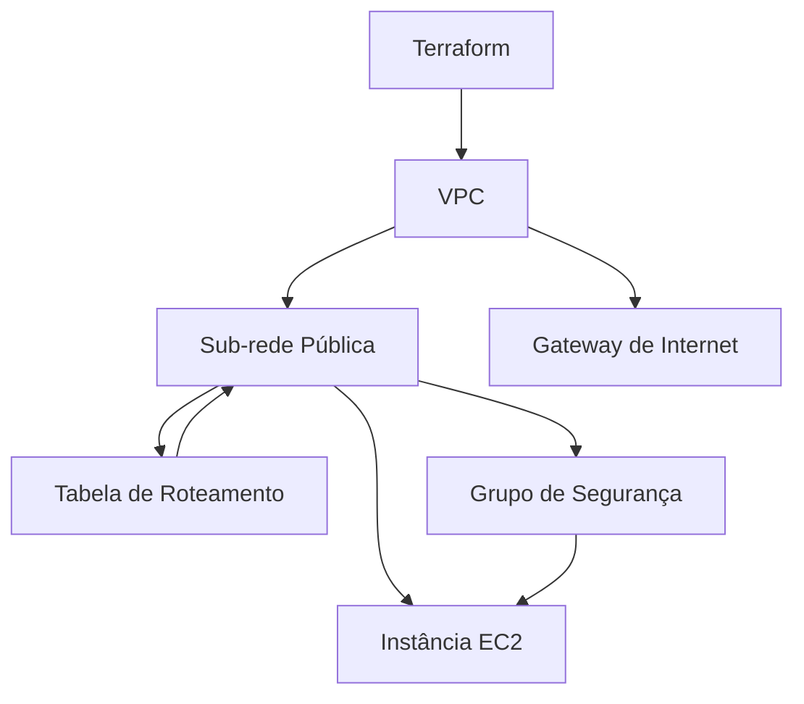

# Terraform Streamlit Deployment

Este projeto usa Terraform para configurar e implantar uma aplicação Streamlit em uma instância EC2 na AWS. Ele cria toda a infraestrutura necessária, incluindo uma VPC, sub-rede pública, gateway de internet, tabela de roteamento, grupo de segurança e a instância EC2.

## Requisitos

- Conta na AWS
- Terraform instalado
- Chave SSH configurada para acessar a instância EC2

## Arquivos do Projeto

- `main.tf`: Configuração principal do Terraform e configuração do backend remoto.
- `remote.tf`: Configuração do backend remoto.
- `variables.tf`: Declaração das variáveis utilizadas na configuração.
- `vpc.tf`: Configuração da VPC, sub-rede pública, gateway de internet e tabela de roteamento.
- `security_group.tf`: Configuração do grupo de segurança.
- `ec2.tf`: Configuração da instância EC2 e script de inicialização.

## Estrutura do Projeto

Aqui está um gráfico em Mermaid para visualizar a infraestrutura:



## Guia de Sintaxe de Configuração do Terraform

Este guia fornece uma visão geral detalhada da sintaxe de configuração do Terraform, que é projetada para ser legível e fácil de escrever. O Terraform utiliza a sintaxe HCL (HashiCorp Configuration Language), que é uma linguagem de configuração rica e intuitiva.

## Estrutura da Linguagem Terraform

### Argumentos

Os argumentos são usados para atribuir valores a nomes específicos. A sintaxe básica é a seguinte:

```hcl
argument_name = "value"
```

- **Nome do argumento**: O identificador antes do sinal de igual (`=`).
- **Valor do argumento**: A expressão após o sinal de igual (`=`).

Os valores dos argumentos podem ser literais ou gerados a partir de outras expressões. Cada tipo de recurso tem um esquema que define os tipos válidos para seus argumentos.

**Exemplo:**

```hcl
image_id = "ami-12345678"
```

### Blocos

Blocos são contêineres para outros conteúdos. A sintaxe básica de um bloco é:

```hcl
block_type "block_name" {
  # Conteúdo do bloco
}
```

- **Tipo de bloco**: Define o tipo de bloco (por exemplo, `resource`, `variable`).
- **Nome do bloco**: Nome arbitrário dado à instância do bloco (por exemplo, `example`).

Os blocos podem conter outros blocos e argumentos, criando uma hierarquia. A estrutura de um bloco é delimitada pelos caracteres `{` e `}`.

**Exemplo de Bloco de Recurso:**

```hcl
resource "aws_instance" "example" {
  ami           = "ami-12345678"
  instance_type = "t2.micro"

  network_interface {
    # Configurações adicionais
  }
}
```

Neste exemplo:
- O tipo de bloco é `resource`.
- O bloco possui dois rótulos: `aws_instance` (tipo de recurso) e `example` (nome da instância do recurso).
- O bloco `network_interface` é um bloco aninhado dentro do bloco principal `aws_instance`.

### Identificadores

Identificadores são usados para nomes de argumentos, tipos de blocos e outros elementos do Terraform. As regras para identificadores incluem:

- Podem conter letras, dígitos, sublinhados (`_`) e hífens (`-`).
- O primeiro caractere não deve ser um dígito.

**Exemplo de Identificadores:**

```hcl
resource "aws_instance" "my_instance" {
  instance_type = "t2.micro"
}
```

Neste exemplo:
- `aws_instance` é o tipo de bloco.
- `my_instance` é o identificador da instância do recurso.

### Comentários

O Terraform suporta três tipos de sintaxe para comentários:

1. **Comentário de Linha Única**:
   - `#`: Começa um comentário que vai até o final da linha.
   - `//`: Alternativa para o comentário de linha única. Pode ser transformado em `#` por ferramentas de formatação automática.

2. **Comentário de Múltiplas Linhas**:
   - `/* ... */`: Delimitadores para comentários que podem se estender por várias linhas.

**Exemplo de Comentários:**

```hcl
# Este é um comentário de linha única

// Este também é um comentário de linha única

/*
Este é um comentário
que pode ocupar várias linhas
*/
```

### Considerações Adicionais

- **Documentação HCL**: A documentação completa da sintaxe HCL pode ser consultada na [especificação da sintaxe HCL](https://github.com/hashicorp/hcl).

- **Formato de Código**: Ferramentas automáticas podem converter comentários `//` para `#` para manter a consistência com a sintaxe recomendada.

Compreender a sintaxe básica e os blocos do Terraform ajuda na criação e gerenciamento eficaz das configurações de infraestrutura como código. Se você deseja se aprofundar, consulte a [documentação oficial do Terraform](https://www.terraform.io/docs) para mais detalhes.


## Arquivos de Configuração

### `main.tf`

```hcl
provider "aws" {
  region = "us-east-1"
}
```

### `remote.tf`

```hcl
terraform {
  backend "s3" {
    # Substitua "bucket-para-salvar-o-estado" pelo nome do seu bucket S3
    bucket         = "bucket-para-salvar-o-estado"
    # O caminho do arquivo de estado dentro do bucket S3
    key            = "terraform-test.tfstate"
    # Região onde o bucket S3 está localizado
    region         = "us-east-1"
    encrypt        = true  # Ativa a criptografia
  }
}
```

### `variables.tf`

```hcl
variable "image_id" {
  description = "ID da AMI a ser usada"
  type        = string
  default     = "ami-0870650fde0fef2d4"

  validation {
    condition     = length(var.image_id) > 4 && substr(var.image_id, 0, 4) == "ami-"
    error_message = "O image_id deve ser um ID de AMI válido, começando com \"ami-\"."
  }
}

variable "instance_type" {
  description = "Tipo de instância EC2"
  type        = string
  default     = "t2.micro"

  validation {
    condition     = var.instance_type != ""
    error_message = "O tipo de instância não pode ser vazio."
  }
}
```

### `vpc.tf`

```hcl
resource "aws_vpc" "main" {
  cidr_block = "10.0.0.0/16"

  tags = {
    Name = "main_vpc"
  }
}

resource "aws_subnet" "public" {
  vpc_id     = aws_vpc.main.id
  cidr_block = "10.0.1.0/24"
  map_public_ip_on_launch = true

  tags = {
    Name = "public_subnet"
  }
}

resource "aws_internet_gateway" "gw" {
  vpc_id = aws_vpc.main.id

  tags = {
    Name = "main_gw"
  }
}

resource "aws_route_table" "public" {
  vpc_id = aws_vpc.main.id

  route {
    cidr_block = "0.0.0.0/0"
    gateway_id = aws_internet_gateway.gw.id
  }

  tags = {
    Name = "public_rt"
  }
}

resource "aws_route_table_association" "a" {
  subnet_id      = aws_subnet.public.id
  route_table_id = aws_route_table.public.id
}
```

### `security_group.tf`

```hcl
resource "aws_security_group" "allow_ssh_http" {
  vpc_id = aws_vpc.main.id

  ingress {
    from_port   = 22
    to_port     = 22
    protocol    = "tcp"
    cidr_blocks = ["0.0.0.0/0"]
  }

  ingress {
    from_port   = 8501
    to_port     = 8501
    protocol    = "tcp"
    cidr_blocks = ["0.0.0.0/0"]
  }

  egress {
    from_port   = 0
    to_port     = 0
    protocol    = "-1"
    cidr_blocks = ["0.0.0.0/0"]
  }

  tags = {
    Name = "allow_ssh_http"
  }
}
```

### `ec2.tf`

```hcl
resource "aws_instance" "streamlit" {
  ami           = var.image_id
  instance_type = var.instance_type
  key_name      = "your-key-name"

  tags = {
    Name = "streamlit_instance"
  }

  user_data = <<-EOF
              #!/bin/bash
              apt update
              apt install -y python3-pip
              pip3 install streamlit
              echo 'streamlit run /home/ubuntu/app.py' >> /etc/rc.local
              EOF
}
```

## Estratégia de Branch com Git e Terraform Workspaces

### Passos para Configuração do Terraform com Workspaces

1. **Configurando Git para Branches**

   No diretório raiz do seu projeto, você pode configurar e gerenciar suas branches dev e prod. Aqui estão os comandos necessários:

   ```bash
   # Inicializar um repositório Git (se ainda não estiver inicializado)
   git init

   # Criar a branch 'dev' e alternar para ela
   git checkout -b dev

   # Adicionar e fazer commit dos arquivos da branch 'dev'
   git add .
   git commit -m "Configuração inicial para o ambiente dev"

   # Criar e alternar para a branch 'prod'
   git checkout -b prod

   # Adicionar e fazer commit dos arquivos da branch 'prod'
   git add .
   git commit -m "Configuração inicial para o ambiente prod"

   # Voltar para a branch 'dev'
   git checkout dev
   ```

2. **Gerenciando Workspaces com Terraform**

   Para alternar entre os ambientes e aplicar as mudanças usando o Terraform, você deve fazer o seguinte:

   ```bash
   # Alternar para a branch 'dev'
   git checkout dev

   # Inicializar o Terraform e criar o workspace de desenvolvimento
   terraform init
   terraform workspace new dev
   terraform workspace select dev
   terraform apply

   # Alternar para a branch 'prod'
   git checkout prod

   # Inicializar o Terraform e criar o workspace de produção
   terraform init
   terraform workspace new prod
   terraform workspace select prod
   terraform apply
   ```

### Considerações Adicionais

- **Variáveis e Arquivos de Configuração**: Caso você precise de variáveis diferentes para dev e prod, você pode criar arquivos `variables.tf` e `terraform.tfvars` específicos para cada ambiente e referenciá-los nos arquivos `main.tf`.

- **Controle de Versão**: Certifique-se de adicionar e versionar todos os arquivos necessários no Git para que o estado e a configuração estejam sempre atualizados e possam ser gerenciados corretamente.

Isso permitirá que você use o Terraform com workspaces para isolar seus ambientes de desenvolvimento e produção, enquanto gerencia a configuração de cada ambiente em branches separadas no Git.
