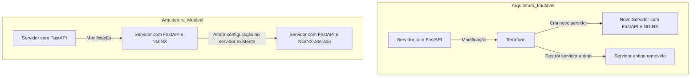

### Implementações e Prática

- **Primeira Implementação**
  - Subindo uma aplicação de Docker no Streamlit
  - Uso de variáveis e outputs
  - Comandos básicos: `init`, `plan`, `apply`, e `destroy`

- **Segunda Implementação**
  - Subindo uma aplicação de storage (S3) e compute (EC2) no LocalStack
  - Uso de módulos para organizar o código
  - Gerenciamento de estado

- **Terceira Implementação**
  - Subindo uma aplicação de storage e compute na AWS
  - Integração com serviços AWS

- **Hands-on Lab**
  - Prática guiada: provisionar recursos na AWS e LocalStack

### Encerramento

- **Perguntas e Respostas**
  - Sessão de perguntas e respostas
  - Próximos passos e recursos adicionais
  - Feedback dos participantes

### Pré-requisitos

- Conhecimento básico de AWS
- Experiência com docker
- Noções básicas de redes e segurança

### Processo de Funcionamento

- Os arquivos locais (`main.tf`, `variables.tf`, `outputs.tf`) definem os recursos, variáveis e outputs para o Terraform.
- O arquivo `terraform.tfstate` armazena o estado atual da infraestrutura gerenciada.
- O Terraform Binary lê as definições dos arquivos locais e o estado armazenado.
- O Terraform consulta o estado atual da infraestrutura na cloud através da `AWS API`.
- Com base na comparação entre o estado armazenado e o estado atual consultado, o Terraform aplica as mudanças necessárias na `AWS Infrastructure`.
- O estado pode ser armazenado remotamente em um `Remote Backend` para facilitar a colaboração e a segurança

## Arquitetura de Servidores: Mutável vs Imutável

### Descrição do Diagrama

#### Arquitetura Mutável

1. **Servidor com FastAPI**: Inicialmente, temos um servidor rodando uma aplicação FastAPI.
2. **Modificação**: Surge a necessidade de adicionar o NGINX.
3. **Servidor com FastAPI e NGINX**: O servidor existente é modificado diretamente para incluir o NGINX.
4. **Servidor com FastAPI e NGINX (alterado)**: A configuração é alterada no servidor existente, mantendo o mesmo servidor com a nova configuração.

#### Arquitetura Imutável

1. **Servidor com FastAPI**: Inicialmente, temos um servidor rodando uma aplicação FastAPI.
2. **Modificação**: Surge a necessidade de adicionar o NGINX.
3. **Terraform**: O Terraform é usado para criar a nova infraestrutura.
4. **Novo Servidor com FastAPI e NGINX**: Um novo servidor é criado com a aplicação FastAPI e NGINX.
5. **Servidor antigo removido**: O servidor antigo é destruído, garantindo que a infraestrutura seja imutável e que qualquer modificação resulte na criação de uma nova instância.

### Vantagens da Arquitetura Imutável

- **Consistência**: Garante que cada mudança na infraestrutura resulte em uma nova instância, evitando divergências de configuração.
- **Reprodutibilidade**: Facilita a reprodução do ambiente, garantindo que as novas instâncias sejam idênticas.
- **Facilidade de reversão**: Caso algo dê errado, é fácil reverter para a configuração anterior, simplesmente destruindo a nova instância e recriando a antiga.

### Vantagens da Arquitetura Mutável

- **Rapidez nas alterações**: Permite modificações rápidas no servidor existente.
- **Menor custo**: Pode ser mais econômico em termos de recursos computacionais, pois não requer a criação de novas instâncias para cada alteração.
