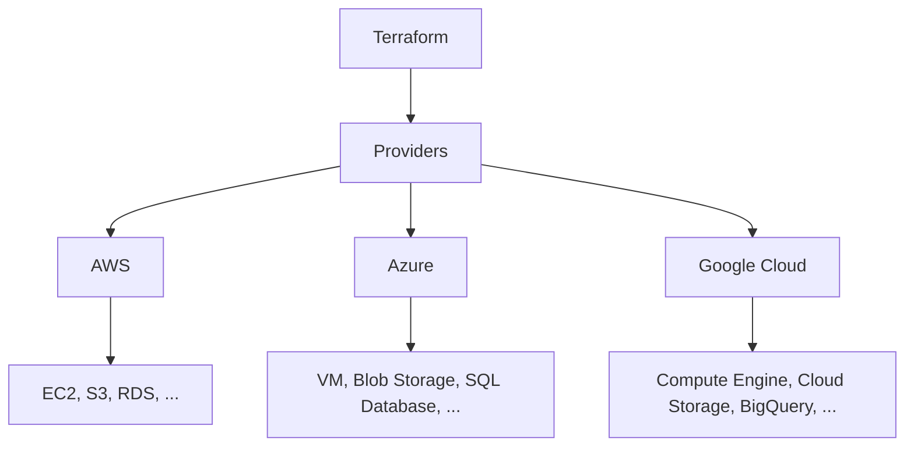

# Providers no Terraform

Os **providers** no Terraform são plugins que permitem que o Terraform interaja com APIs de serviços externos. Cada provider tem seu próprio conjunto de recursos e pode gerenciar diferentes tipos de infraestrutura. Os providers são fundamentais para o Terraform, pois fornecem as funcionalidades necessárias para criar, atualizar e excluir recursos na infraestrutura.

## Principais Funções dos Providers:

1. **Gerenciamento de Recursos:**
   - Os providers permitem que o Terraform crie, leia, atualize e exclua recursos na infraestrutura.
   - Eles mapeiam recursos do Terraform para APIs de provedores de serviços, como AWS, Azure, Google Cloud, entre outros.

2. **Abstração de Infraestrutura:**
   - Providers abstraem os detalhes específicos da API do provedor de serviços, oferecendo uma interface consistente para gerenciar recursos.
   - Isso simplifica a configuração e o gerenciamento da infraestrutura em diferentes ambientes e provedores.

3. **Configuração de Provedores:**
   - A configuração de um provider é feita através de blocos `provider` no código do Terraform.
   - Esses blocos especificam detalhes como credenciais de acesso, regiões e outras configurações necessárias para interagir com o serviço.

### Exemplo de Configuração de Provider:

```hcl
provider "aws" {
  region  = "us-west-2"
  version = "~> 2.0"
}
```

Nesse exemplo, o provider `aws` é configurado para a região `us-west-2` e a versão do provider é restrita para versões `2.x`.

#### Tipos Comuns de Providers:

- **Cloud Providers:**
  - AWS (Amazon Web Services)
  - Azure (Microsoft Azure)
  - Google Cloud Platform (GCP)
- **Infraestrutura como Serviço:**
  - VMware
  - OpenStack
- **Plataformas de Conteúdo:**
  - GitHub
  - GitLab
- **Outros Serviços:**
  - Kubernetes
  - Datadog
  - New Relic

#### Diagrama em Mermaid

O diagrama abaixo ilustra a relação entre o Terraform, os providers e a infraestrutura na nuvem.



### Descrição do Diagrama

- **Terraform:** Ferramenta principal que orquestra a configuração e o gerenciamento da infraestrutura.
- **Providers:** Plugins que permitem ao Terraform interagir com diferentes serviços de nuvem.
  - **AWS:** Provider para Amazon Web Services, que inclui recursos como EC2, S3, RDS, entre outros.
  - **Azure:** Provider para Microsoft Azure, que inclui recursos como VMs, Blob Storage, SQL Database, entre outros.
  - **Google Cloud:** Provider para Google Cloud Platform, que inclui recursos como Compute Engine, Cloud Storage, BigQuery, entre outros.

### Conclusão

Os providers são componentes essenciais no Terraform, pois permitem a interação com diversos serviços e APIs, abstraindo complexidades e facilitando o gerenciamento de recursos de infraestrutura. Através de uma configuração simples e consistente, os providers possibilitam a criação de infraestrutura robusta e escalável em múltiplos ambientes de nuvem e outros serviços.

Se precisar de mais alguma coisa ou tiver alguma dúvida, estou à disposição!