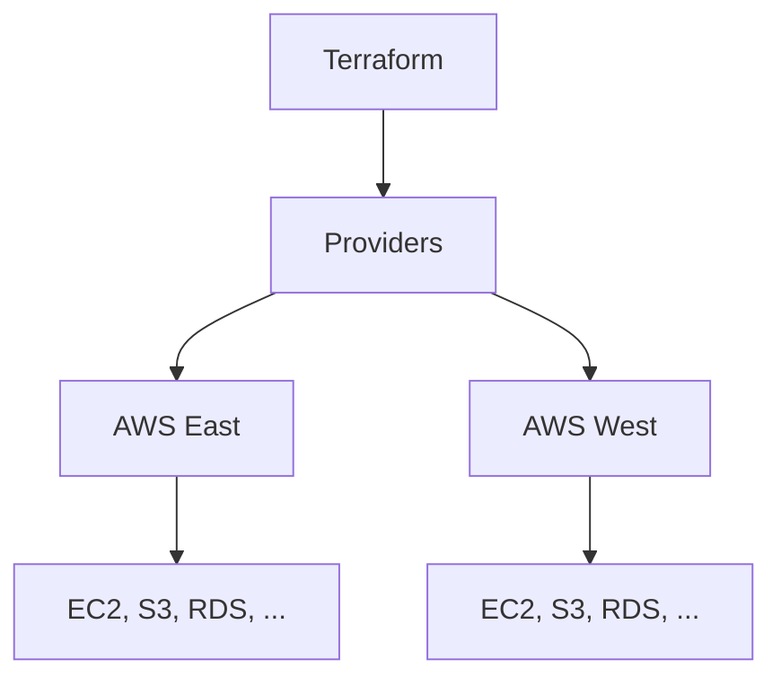

### Trabalhando com Múltiplos Providers no Terraform

No Terraform, você pode usar múltiplos providers para gerenciar recursos em diferentes ambientes ou regiões. Isso é particularmente útil quando você precisa orquestrar infraestrutura distribuída ou interagir com vários serviços de diferentes provedores de nuvem. Vamos explorar como configurar e utilizar múltiplos providers com base em um exemplo prático.

#### Configurando Múltiplos Providers

Quando você deseja utilizar múltiplos providers, você deve definir cada provider com um alias. Isso permite que você faça referência específica a cada provider em suas configurações de recursos.

**Exemplo de Configuração com Múltiplos Providers:**

```hcl
provider "aws" {
  region = "us-east-1"
}

provider "aws" {
  alias  = "west-2"
  region = "us-west-2"
}
```

Neste exemplo, estamos configurando dois providers AWS: um para a região `us-east-1` e outro para a região `us-west-2`. O segundo provider usa um alias `west-2` para diferenciá-lo do provider padrão.

#### Usando Data Sources com Múltiplos Providers

Data sources permitem que você busque informações sobre recursos existentes. Quando utiliza múltiplos providers, você pode especificar o provider a ser usado com o atributo `provider`.

**Exemplo de Data Sources:**

```hcl
data "aws_ami" "ubuntu_east" {
  most_recent = true

  filter {
    name   = "name"
    values = ["ubuntu/images/hvm-ssd/ubuntu-focal-20.04-amd64-server-*"]
  }

  owners = ["099720109477"] # Ubuntu
}

data "aws_ami" "ubuntu_west" {
  provider    = aws.west-2
  most_recent = true

  filter {
    name   = "name"
    values = ["ubuntu/images/hvm-ssd/ubuntu-focal-20.04-amd64-server-*"]
  }

  owners = ["099720109477"] # Ubuntu
}
```

#### Criando Recursos com Múltiplos Providers

Você pode criar recursos utilizando os diferentes providers configurados. Para isso, você precisa especificar qual provider utilizar para cada recurso.

**Exemplo de Recursos:**

```hcl
resource "aws_instance" "web_east" {
  ami           = data.aws_ami.ubuntu_east.id
  instance_type = "t2.micro"

  tags = {
    Name = "WebServerEast"
  }
}

resource "aws_instance" "web_west" {
  provider      = aws.west-2
  ami           = data.aws_ami.ubuntu_west.id
  instance_type = "t2.micro"

  tags = {
    Name = "WebServerWest"
  }
}
```

### Descrição do Exemplo

1. **Configuração dos Providers:**
   - **Provider Padrão:** Configurado para a região `us-east-1`.
   - **Provider com Alias:** Configurado para a região `us-west-2` usando o alias `west-2`.

2. **Data Sources:**
   - **Data Source `aws_ami.ubuntu_east`:** Busca o AMI mais recente do Ubuntu na região `us-east-1`.
   - **Data Source `aws_ami.ubuntu_west`:** Busca o AMI mais recente do Ubuntu na região `us-west-2` utilizando o provider `aws.west-2`.

3. **Recursos:**
   - **Recurso `aws_instance.web_east`:** Cria uma instância EC2 na região `us-east-1` utilizando o AMI buscado pelo data source `aws_ami.ubuntu_east`.
   - **Recurso `aws_instance.web_west`:** Cria uma instância EC2 na região `us-west-2` utilizando o AMI buscado pelo data source `aws_ami.ubuntu_west` e especificando o provider `aws.west-2`.

### Benefícios de Utilizar Múltiplos Providers

1. **Gerenciamento de Infraestrutura Distribuída:**
   - Permite gerenciar recursos em múltiplas regiões ou contas de provedor de nuvem, facilitando a distribuição geográfica da infraestrutura.

2. **Isolamento e Organização:**
   - Facilita o isolamento de ambientes de desenvolvimento, teste e produção, permitindo configurações específicas para cada ambiente.

3. **Flexibilidade e Escalabilidade:**
   - Oferece flexibilidade para integrar múltiplos serviços de diferentes provedores em uma única configuração de infraestrutura como código.

### Diagrama em Mermaid



### Conclusão

Utilizar múltiplos providers no Terraform é uma prática poderosa que permite gerenciar infraestrutura complexa e distribuída de maneira eficiente e organizada. Com a configuração correta, você pode orquestrar recursos em diferentes regiões e provedores de serviços, garantindo flexibilidade e escalabilidade para suas operações de infraestrutura.