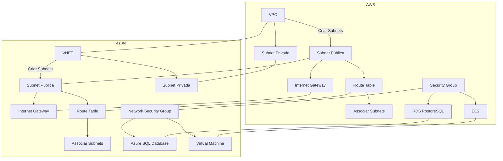
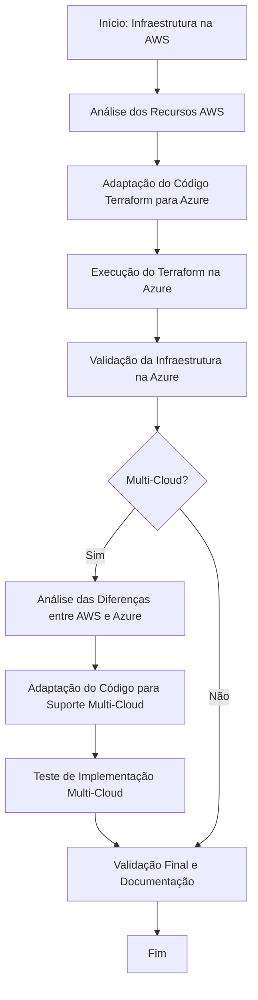

# Parte 8: Migração Multi-Cloud com Terraform

## Objetivo

Na última parte do workshop, exploraremos como adaptar um projeto Terraform para ser compatível com múltiplos provedores de nuvem (AWS e Azure). Vamos discutir as diferenças entre os provedores e como ajustar o código para suportar uma infraestrutura multi-cloud.

### Passos para Implementação Multi-Cloud

1. **Análise das Diferenças entre Provedores:**
   - Identificar as principais diferenças nos recursos e configurações entre AWS e Azure.
   - Revisar as documentações específicas dos provedores para entender as limitações e considerações.

Claro! Vou criar um diagrama usando Mermaid que compara os recursos da AWS com os recursos equivalentes da Azure. O diagrama mostrará a arquitetura atual com AWS e a arquitetura planejada com Azure.

### Diagrama Mermaid

Entendi! Vou criar um diagrama com uma correspondência 1 para 1 entre os recursos AWS e Azure. Aqui está a arquitetura reformulada:

### Explicação:

- **VPC (AWS)** → **VNET (Azure)**: Rede virtual.
- **Subnet Pública (AWS)** → **Subnet Pública (Azure)**: Subrede acessível publicamente.
- **Subnet Privada (AWS)** → **Subnet Privada (Azure)**: Subrede isolada.
- **Internet Gateway (AWS)** → **Internet Gateway (Azure)**: Gateway para acesso à internet.
- **Route Table (AWS)** → **Route Table (Azure)**: Tabela de roteamento para as subnets.
- **Security Group (AWS)** → **Network Security Group (Azure)**: Grupo de segurança para controlar acesso.
- **RDS PostgreSQL (AWS)** → **Azure SQL Database (Azure)**: Banco de dados gerenciado.
- **EC2 (AWS)** → **Virtual Machine (Azure)**: Instância de máquina virtual.

Se precisar de ajustes ou quiser adicionar mais detalhes, é só me avisar!
### Descrição das Equivalências

- **VPC (AWS)** ↔ **Virtual Network (Azure)**
- **Subnet Pública (AWS)** ↔ **Public Subnet (Azure)**
- **Subnet Privada (AWS)** ↔ **Private Subnet (Azure)**
- **Internet Gateway (AWS)** ↔ **Não há um equivalente direto; a funcionalidade é geralmente gerida pelo Route Table e Network Security Group na Azure.**
- **Route Table (AWS)** ↔ **Network Security Group (Azure)**
- **Security Group (AWS)** ↔ **Network Security Group (Azure)**
- **EC2 Instance (AWS)** ↔ **Virtual Machine (Azure)**
- **RDS PostgreSQL (AWS)** ↔ **SQL Database (Azure)**

Esse diagrama ajuda a visualizar as correspondências entre os recursos da AWS e os recursos equivalentes da Azure para facilitar a migração. Se precisar de mais detalhes ou ajustes, é só avisar!

2. **Adaptação do Código Terraform:**
   - Modularizar o código para que possa ser reutilizado com diferentes provedores.
   - Configurar variáveis dinâmicas para permitir fácil alternância entre AWS e Azure.

3. **Teste de Implementação Multi-Cloud:**
   - Executar testes para garantir que a infraestrutura pode ser provisionada em ambos os provedores sem conflitos.
   - Validar a interoperabilidade e redundância entre os ambientes.

4. **Melhores Práticas em Ambientes Multi-Cloud:**
   - Discussão sobre a manutenção e monitoramento de uma infraestrutura multi-cloud.
   - Considerações de segurança e gestão de custos.

## Diagrama de Fluxo (Mermaid)

Aqui está um diagrama de fluxo que ilustra o processo de migração do projeto da AWS para a Azure e a adaptação para uma infraestrutura multi-cloud.

