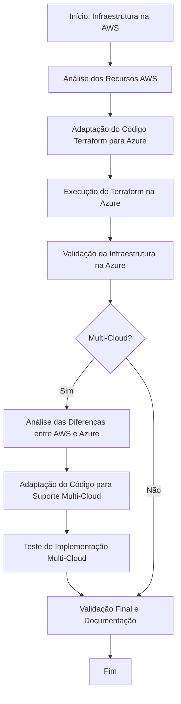

# Parte 8: Migração Multi-Cloud com Terraform

## Objetivo

Na última parte do workshop, exploraremos como adaptar um projeto Terraform para ser compatível com múltiplos provedores de nuvem (AWS e Azure). Vamos discutir as diferenças entre os provedores e como ajustar o código para suportar uma infraestrutura multi-cloud.

### Passos para Implementação Multi-Cloud

1. **Análise das Diferenças entre Provedores:**
   - Identificar as principais diferenças nos recursos e configurações entre AWS e Azure.
   - Revisar as documentações específicas dos provedores para entender as limitações e considerações.

2. **Adaptação do Código Terraform:**
   - Modularizar o código para que possa ser reutilizado com diferentes provedores.
   - Configurar variáveis dinâmicas para permitir fácil alternância entre AWS e Azure.

3. **Teste de Implementação Multi-Cloud:**
   - Executar testes para garantir que a infraestrutura pode ser provisionada em ambos os provedores sem conflitos.
   - Validar a interoperabilidade e redundância entre os ambientes.

4. **Melhores Práticas em Ambientes Multi-Cloud:**
   - Discussão sobre a manutenção e monitoramento de uma infraestrutura multi-cloud.
   - Considerações de segurança e gestão de custos.

## Diagrama de Fluxo (Mermaid)

Aqui está um diagrama de fluxo que ilustra o processo de migração do projeto da AWS para a Azure e a adaptação para uma infraestrutura multi-cloud.

